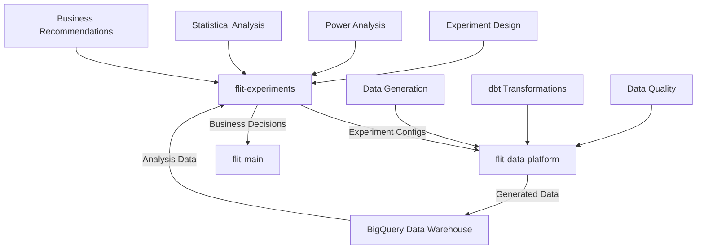

# 🧪 Flit Experiments

> **Advanced A/B Testing & Experimentation Platform**  
> Rigorous experimental design, statistical analysis, and business decision frameworks for data-driven growth

[](https://python.org)
[](https://scipy.org)
[](https://github.com)

## **Mission Statement**

The Flit Experiments repository embodies **data science experimentation practices**, demonstrating sophisticated statistical thinking, rigorous experimental design, and business-oriented decision frameworks. This platform showcases end-to-end experimentation flows from hypothesis formation through business impact measurement.

## **Architecture & Repository Relationship**

### **Multi-Repository Experimentation Ecosystem**

Flit Experiments operates as part of a **distributed data science architecture** designed to mirror real-world enterprise experimentation platforms:



### **Service Boundaries & Responsibilities**

| Repository | Primary Responsibility | Data Flow |
|------------|----------------------|-----------|
| **flit-experiments** | Experimental design, statistical analysis, business decisions | **Produces** experiment specifications → **Consumes** analysis-ready data |
| **flit-data-platform** | Data generation, transformations, warehouse management | **Consumes** experiment specifications → **Produces** analysis-ready datasets |
| **flit-main** | Orchestration, documentation, deployment | **Consumes** business recommendations → **Produces** strategic direction |

### **Configuration as a Service Pattern**

This repository implements **Configuration as a Service**, where experiment specifications are packaged and versioned for consumption by data engineering systems:

```python
# flit-experiments produces versioned configurations
flit-experiment-configs==1.2.0

# flit-data-platform consumes specific versions
from flit_experiment_configs import get_experiment_config
config = get_experiment_config("free_shipping_threshold_test")
```

**Benefits of this architecture:**
- **🔄 Reproducibility:** Exact experiment specifications are versioned and tracked
- **🚀 Scalability:** Multiple data systems can consume experiment configurations
- **🛡 Change Control:** Configuration changes require explicit version bumps and validation
- **🔗 Loose Coupling:** Experimentation logic is decoupled from data engineering concerns

---

## **Experimental Methodology**

The experimentation framework demonstrates **advanced statistical thinking** that goes beyond basic A/B testing:

#### **1. Hypothesis-Driven Design**
- **Primary hypotheses** with specific effect size predictions
- **Secondary hypotheses** for understanding trade-offs and unintended consequences  
- **Guardrail metrics** with predefined stop conditions for business safety

#### **2. Statistical Rigor**
- **Power analysis** to determine required sample sizes and test duration
- **Stratified randomization** to ensure balanced treatment assignment
- **Multiple testing corrections** when analyzing multiple metrics
- **Sequential testing** capabilities for early stopping decisions

#### **3. Business Context Integration**
- **Seasonal considerations** for temporal validity of results
- **Customer segment analysis** for heterogeneous treatment effects
- **Revenue impact modeling** for business case development
- **Risk assessment frameworks** for launch/no-launch decisions

### **Experimental Categories**
Below are some categories we will run experimentation on. The list is definitely not exhaustive as other kinds of tests should come up in the ordinary course of business.

#### ** E-commerce Optimization Experiments**
Revenue-focused tests that optimize the customer purchase journey:

- **Pricing Strategy Tests:** Free shipping thresholds, discount structures, dynamic pricing
- **User Experience Tests:** Checkout flow optimization, page layout variants, mobile UX
- **Product Discovery Tests:** Search algorithms, recommendation engines, category navigation

#### ** Machine Learning Experiments** 
Algorithm performance and model effectiveness testing:

- **Recommendation Systems:** Collaborative filtering vs. content-based vs. hybrid approaches
- **Personalization Algorithms:** Dynamic content, targeted messaging, adaptive interfaces
- **Predictive Model Validation:** Churn prediction, LTV modeling, demand forecasting

#### ** Growth & Engagement Experiments**
User behavior and retention optimization:

- **Onboarding Optimization:** User activation flows, tutorial effectiveness, feature adoption
- **Retention Strategies:** Email campaigns, push notification timing, engagement mechanics
- **Monetization Tests:** Subscription models, freemium conversion, pricing psychology

#### ** Advanced Statistical Methods**
Sophisticated experimental designs for complex business questions:

- **Multi-Armed Bandit Tests:** Dynamic allocation for continuous optimization
- **Factorial Designs:** Testing interaction effects between multiple variables
- **Difference-in-Differences:** Causal inference for policy changes and market interventions
- **Regression Discontinuity:** Natural experiments around threshold-based rules

---

## **Technical Implementation**

### **Power Analysis & Sample Size Calculation**
```python
# Sophisticated statistical planning
analyzer = ExperimentPowerAnalysis()
results = analyzer.assess_experiment_feasibility("free_shipping_threshold_test")

# Outputs: required sample size, test duration, calendar optimization (start-stop decision)
```

### **Experiment Configuration Management**
```yaml
# Comprehensive experiment specifications
experiments:
  free_shipping_threshold_test:
    hypothesis:
      primary: "8% conversion rate improvement"
      secondary: ["<5% AOV decrease acceptable"]
    
    eligibility_criteria: # Incorporate business logic to exclude certain kinds of users from the experiment
      include: ["new_customers", "returning_customers"]
      exclude: ["vip_customers", "employee_accounts"]
      
    stratification: # To ensure proper representation in both the control and treatment groups
      balance_across: ["customer_segment", "device_type", "geography"]
```

### **Statistical Analysis Pipeline**
```python
# Production-quality statistical testing
results = ExperimentAnalyzer.analyze_experiment(
    experiment_name="free_shipping_threshold_test",
    primary_metric="conversion_rate",
    alpha=0.05,
    multiple_testing_correction="bonferroni"
)

# Automated business recommendations
decision = BusinessDecisionFramework.make_recommendation(results)
```

---

## 📁 **Repository Structure**

```
flit-experiments/
├── flit_experiment_configs/          # Configuration Package
│   ├── __init__.py
│   ├── configs/
│   │   └── experiments.yaml         # All experiment specifications
│   └── client.py                    # Configuration access methods
│
├── design/                          # Experiment Design & Planning
│   ├── power_analysis.py           # Statistical power calculations
│   ├── experiment_calendar.py      # Temporal planning & scheduling
│   └── templates/                  # Experiment design templates
│
├── analysis/                       # Statistical Analysis & Testing
│   ├── experiment_analyzer.py      # Core statistical testing
│   ├── effect_size_estimation.py   # Confidence intervals, bootstrapping
│   ├── sequential_testing.py       # Early stopping analysis
│   └── subgroup_analysis.py        # Heterogeneous treatment effects
│
├── business/                       # Business Intelligence & Decisions
│   ├── decision_framework.py       # Launch/no-launch recommendations
│   ├── roi_modeling.py            # Revenue impact calculations
│   ├── risk_assessment.py         # Business risk evaluation
│   └── reporting.py               # Executive summaries & dashboards
│
├── tests/                          # Testing & Validation
│   ├── test_power_analysis.py     # Statistical calculation validation
│   ├── test_experiment_logic.py   # Business logic testing
│   └── test_config_validation.py  # Configuration schema validation
│
├── setup.py                       # Package configuration
├── pyproject.toml                 # Modern Python packaging
├── requirements.txt               # Dependencies
└── README.md                      # This file
```

---
---

##  **Getting Started**

### **Prerequisites**
- Python 3.9+
- Statistical analysis libraries (scipy, statsmodels, numpy, pandas)
- Access to BigQuery for analysis data consumption
- Understanding of experimental design principles

### **Installation & Setup**
```bash
# Clone the repository
git clone https://github.com/whitehackr/flit-experiments.git
cd flit-experiments

# Install dependencies
pip install -r requirements.txt

# Install the configuration package in development mode
pip install -e .

# Validate installation
python -c "from flit_experiment_configs import get_experiment_config; print('✅ Setup complete')"
```

##### Basic Package validation tests
More fully, before anything else, just check that the installation of the package went well and you are able to use it well.

After the `pip install -e .` command, this is what you should see on your terminal:

```bash
Obtaining file:///Users/kevin/Documents/repos/flit-experiments
  Installing build dependencies ... done
  Checking if build backend supports build_editable ... done
  Getting requirements to build editable ... done
  Preparing editable metadata (pyproject.toml) ... done
Requirement already satisfied: pyyaml>=6.0 in /Users/kevin/anaconda3/envs/flit/lib/python3.11/site-packages (from flit-experiment-configs==1.0.0) (6.0)
Requirement already satisfied: pydantic>=1.10.0 in /Users/kevin/anaconda3/envs/flit/lib/python3.11/site-packages (from flit-experiment-configs==1.0.0) (1.10.8)
Requirement already satisfied: typing-extensions>=4.2.0 in /Users/kevin/anaconda3/envs/flit/lib/python3.11/site-packages (from pydantic>=1.10.0->flit-experiment-configs==1.0.0) (4.7.1)
Building wheels for collected packages: flit-experiment-configs
  Building editable for flit-experiment-configs (pyproject.toml) ... done
  Created wheel for flit-experiment-configs: filename=flit_experiment_configs-1.0.0-0.editable-py3-none-any.whl size=9645 sha256=1b4360f7c44f4fc9bba0a64bb6e3425b0da5f4a98380e48a092901ab518c09fc
  Stored in directory: /private/var/folders/_j/wp2dn1j50cjdbptz4v2qwl840000gn/T/pip-ephem-wheel-cache-8enyvp7d/wheels/44/f1/1a/80be7ab05c6c5196064c8f316e1b18d253945d7f22504edba6
Successfully built flit-experiment-configs
Installing collected packages: flit-experiment-configs
Successfully installed flit-experiment-configs-1.0.0
```

First, test that basic importation works:

```bash
(flit) kevin@Kevins-MacBook-Pro flit-experiments % python -c "     
from flit_experiment_configs import get_experiment_config, get_package_version
print('✅ Imports successful')
print(f'Package version: {get_package_version()}')
"
✅ Imports successful
Package version: 1.0.0
```
Then, let's test configs reading

```bash
(flit) kevin@Kevins-MacBook-Pro flit-experiments % python -c "
from flit_experiment_configs import get_experiment_config, list_available_experiments

# List experiments
experiments = list_available_experiments()
print(f'Available experiments: {experiments}')

# Get config
config = get_experiment_config('free_shipping_threshold_test')
print(f'✅ Config loaded for: {config[\"design\"][\"experiment_name\"]}')
print(f'Primary hypothesis: {config[\"hypothesis\"][\"primary\"]}')
"
Available experiments: ['free_shipping_threshold_test', 'checkout_simplification_test', 'recommendation_algorithm_test']
✅ Config loaded for: free_shipping_threshold_test
Primary hypothesis: Reducing free shipping threshold from $50 to $35 will increase conversion  rate by 8% relative (4.5% → 4.86%) due to reduced purchase friction
```

Then you can test error handling:

```bash
(flit) kevin@Kevins-MacBook-Pro flit-experiments % python -c "
from flit_experiment_configs import get_experiment_config
try:
    get_experiment_config('nonexistent_experiment')
except Exception as e:
    print(f'✅ Error handling works: {e}')
"
✅ Error handling works: Experiment 'nonexistent_experiment' not found. Available experiments: ['free_shipping_threshold_test', 'checkout_simplification_test', 'recommendation_algorithm_test']

```
Package installed correctly, and you're good to go!


### **Quick Start: Your First Experiment**
```python
# 1. Design your experiment
from design.power_analysis import ExperimentPowerAnalysis

analyzer = ExperimentPowerAnalysis()
feasibility = analyzer.assess_experiment_feasibility("free_shipping_threshold_test")

# 2. Generate data (in flit-data-platform)
# Data generation consumes the experiment configuration
# This data generation is basically a simulaion of the experiment happening. In an ordinary (non-hypothetical) business env, this is basiclaly running the experiment

# 3. Analyze results
from analysis.experiment_analyzer import ExperimentAnalyzer

results = ExperimentAnalyzer.analyze_experiment("free_shipping_threshold_test")

# 4. Make business decision
from business.decision_framework import BusinessDecisionFramework

recommendation = BusinessDecisionFramework.make_recommendation(results)
```

---

## 📈 **Planned Experiments**
Some of the tests we plan to carry out using the flow outlined above include:

### **Phase 1: E-commerce Fundamentals**
- **Free Shipping Threshold Optimization** - Revenue impact of threshold changes
- **Checkout Process Simplification** - Conversion rate optimization through UX
- **Product Recommendation Algorithm** - ML-driven cross-selling effectiveness

### **Phase 2: Advanced Personalization**
- **Dynamic Pricing Experiments** - Price elasticity and revenue optimization
- **Personalized Homepage Experience** - Content personalization impact
- **Email Campaign Optimization** - Engagement and retention improvement

### **Phase 3: Sophisticated Methodologies**
- **Multi-Armed Bandit Implementation** - Continuous optimization frameworks
- **Causal Inference Studies** - Advanced statistical methods for complex business questions
- **Long-term Impact Assessment** - Customer lifetime value and behavior modeling

---

## 🤝 **Integration with Data Platform**

### **Data Flow Architecture**

1. **Experiment Design (This Repo)**
   ```python
   # Define experiment in experiments.yaml
   # Run power analysis to validate feasibility
   # Package configuration for consumption
   ```

2. **Data Generation (flit-data-platform)**
   ```python
   # Consume experiment configuration
   from flit_experiment_configs import get_experiment_config
   config = get_experiment_config("experiment_name")
   
   # Generate synthetic experiment data
   generate_experiment_data(config)
   ```

3. **Data Processing (flit-data-platform)**
   ```sql
   -- dbt models transform raw experiment data
   -- Create analysis-ready datasets
   -- Ensure data quality and consistency
   ```

4. **Statistical Analysis (This Repo)**
   ```python
   # Consume processed data from BigQuery
   # Run statistical tests and effect size estimation
   # Generate business recommendations
   ```

### **Version Management**
Each experiment configuration is versioned to ensure **reproducibility**:

```bash
# Experiment design changes trigger version bumps
v1.0.0: Initial free shipping threshold experiment
v1.1.0: Added secondary metrics and guardrails  
v1.2.0: Extended eligibility criteria

v2.0.0: Added checkout simplification experiment
...
```

---

## **Business Impact Demonstration**

This repository showcases **real-world data science value creation**:

- ** Revenue Optimization:** Quantified impact of pricing and UX changes on business metrics
- ** Risk Management:** Systematic approach to experimental risk assessment and mitigation  
- ** Decision Frameworks:** Clear criteria for launch/no-launch decisions based on statistical evidence
- ** Operational Efficiency:** Streamlined experimentation processes for faster iteration cycles
- ** Scientific Rigor:** Publication-quality statistical analysis and methodology documentation

---

## **Professional Development Showcase**

### **Senior Data Scientist Competencies Demonstrated**
- **Strategic Thinking:** Business-oriented experimental design and hypothesis formation
- **Statistical Expertise:** Advanced methods beyond basic A/B testing
- **Technical Leadership:** Architecture design for scalable experimentation platforms
- **Communication Skills:** Executive reporting and business stakeholder management
- **Methodological Rigor:** Reproducible research practices and scientific validity

### **Industry Best Practices**
- **Configuration as Code:** Versioned, auditable experiment specifications
- **Separation of Concerns:** Clean boundaries between design, data, and analysis
- **Automated Decision Making:** Systematic frameworks for business recommendations
- **Quality Assurance:** Comprehensive testing of statistical calculations and business logic

---

## **Documentation & Learning Resources**
[These will remain empty for now, but would house the org's playbooks on the said topics]
- **[Experiment Design Methodology](docs/experiment_design.md)** - Comprehensive guide to hypothesis formation and experimental planning
- **[Statistical Analysis Guide](docs/statistical_analysis.md)** - Advanced methods and interpretation frameworks  
- **[Business Decision Framework](docs/business_decisions.md)** - Criteria and processes for launch decisions
- **[Integration Patterns](docs/integration.md)** - Architectural patterns for experimentation platforms

---

## **Contributing**

We welcome contributions that advance the sophistication and business value of our experimentation platform:

1. **Experiment Design:** New experimental methodologies and business use cases
2. **Statistical Methods:** Advanced analysis techniques and effect size estimation
3. **Business Intelligence:** Enhanced decision frameworks and ROI modeling
4. **Documentation:** Methodology explanations and best practice guides

---

## 📄 **License**

This project is licensed under the MIT License - see the [LICENSE](LICENSE) file for details.

---

*Built with ❤️ for advancing data science experimentation practices.*
