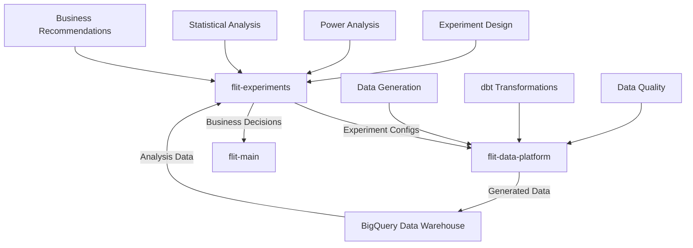

# 🧪 Flit Experiments

> **Advanced A/B Testing & Experimentation Platform**  
> Rigorous experimental design, statistical analysis, and business decision frameworks for data-driven growth

[](https://python.org)
[](https://scipy.org)
[](https://github.com)

## **Overview**

Flit Experiments is an A/B testing and experimentation platform that provides statistical analysis, experimental design, and business decision frameworks. The platform includes end-to-end experimentation workflows from hypothesis formation through business impact measurement.

## **Architecture & Repository Relationship**

### **Multi-Repository Experimentation Ecosystem**

Flit Experiments operates as part of a **distributed data science architecture** designed to mirror real-world enterprise experimentation platforms:


```mermaid
graph TB
    A[flit-experiments] -->|Experiment Configs| B[flit-data-platform]
    B -->|Generated Data| C[BigQuery Data Warehouse]
    C -->|Analysis Data| A
    A -->|Business Decisions| D[flit-main]
    
    A1[Experiment Design] --> A
    A2[Power Analysis] --> A
    A3[Statistical Analysis] --> A
    A4[Business Recommendations] --> A
    
    B1[Data Generation] --> B
    B2[dbt Transformations] --> B
    B3[Data Quality] --> B
```

### **Service Boundaries & Responsibilities**

| Repository | Primary Responsibility | Data Flow |
|------------|----------------------|-----------|
| **flit-experiments** | Experimental design, statistical analysis, business decisions | **Produces** experiment specifications → **Consumes** analysis-ready data |
| **flit-data-platform** | Data generation, transformations, warehouse management | **Consumes** experiment specifications → **Produces** analysis-ready datasets |
| **flit-main** | Orchestration, documentation, deployment | **Consumes** business recommendations → **Produces** strategic direction |

### **Configuration as a Service Pattern**

This repository implements **Configuration as a Service**, where experiment specifications are packaged and versioned for consumption by data engineering systems:

```python
# flit-experiments produces versioned configurations
flit-experiment-configs==1.2.0

# flit-data-platform consumes specific versions
from flit_experiment_configs import get_experiment_config
config = get_experiment_config("free_shipping_threshold_test")
```

**Benefits of this architecture:**
- **🔄 Reproducibility:** Exact experiment specifications are versioned and tracked
- **🚀 Scalability:** Multiple data systems can consume experiment configurations
- **🛡 Change Control:** Configuration changes require explicit version bumps and validation
- **🔗 Loose Coupling:** Experimentation logic is decoupled from data engineering concerns

---

## **Experimental Methodology**

The experimentation framework provides statistical methods that extend beyond basic A/B testing:

#### **1. Hypothesis-Driven Design**
- **Primary hypotheses** with specific effect size predictions
- **Secondary hypotheses** for understanding trade-offs and unintended consequences  
- **Guardrail metrics** with predefined stop conditions for business safety

#### **2. Statistical Rigor**
- **Power analysis** to determine required sample sizes and test duration
- **Stratified randomization** to ensure balanced treatment assignment
- **Multiple testing corrections** when analyzing multiple metrics
- **Sequential testing** capabilities for early stopping decisions

#### **3. Business Context Integration**
- **Seasonal considerations** for temporal validity of results
- **Customer segment analysis** for heterogeneous treatment effects
- **Revenue impact modeling** for business case development
- **Risk assessment frameworks** for launch/no-launch decisions

### **Experimental Categories**
Below are some categories we will run experimentation on. The list is definitely not exhaustive as other kinds of tests should come up in the ordinary course of business.

#### ** E-commerce Optimization Experiments**
Revenue-focused tests that optimize the customer purchase journey:

- **Pricing Strategy Tests:** Free shipping thresholds, discount structures, dynamic pricing
- **User Experience Tests:** Checkout flow optimization, page layout variants, mobile UX
- **Product Discovery Tests:** Search algorithms, recommendation engines, category navigation

#### ** Machine Learning Experiments** 
Algorithm performance and model effectiveness testing:

- **Recommendation Systems:** Collaborative filtering vs. content-based vs. hybrid approaches
- **Personalization Algorithms:** Dynamic content, targeted messaging, adaptive interfaces
- **Predictive Model Validation:** Churn prediction, LTV modeling, demand forecasting

#### ** Growth & Engagement Experiments**
User behavior and retention optimization:

- **Onboarding Optimization:** User activation flows, tutorial effectiveness, feature adoption
- **Retention Strategies:** Email campaigns, push notification timing, engagement mechanics
- **Monetization Tests:** Subscription models, freemium conversion, pricing psychology

#### ** Advanced Statistical Methods**
Sophisticated experimental designs for complex business questions:

- **Multi-Armed Bandit Tests:** Dynamic allocation for continuous optimization
- **Factorial Designs:** Testing interaction effects between multiple variables
- **Difference-in-Differences:** Causal inference for policy changes and market interventions
- **Regression Discontinuity:** Natural experiments around threshold-based rules

---

## **Technical Implementation**

### **Power Analysis & Sample Size Calculation**
```bash
# CLI-based power analysis with detailed output
python run_power_analysis.py free_shipping_threshold_test --verbose

# Historical simulation mode
python run_power_analysis.py free_shipping_threshold_test --reference-date 2024-03-01

# Save results to JSON for further analysis
python run_power_analysis.py free_shipping_threshold_test --output results.json
```

### **Experiment Configuration Management**
```yaml
# Comprehensive experiment specifications
experiments:
  free_shipping_threshold_test:
    hypothesis:
      primary: "8% conversion rate improvement"
      secondary: ["<5% AOV decrease acceptable"]
    
    eligibility_criteria: # Incorporate business logic to exclude certain kinds of users from the experiment
      include: ["new_customers", "returning_customers"]
      exclude: ["vip_customers", "employee_accounts"]
      
    stratification: # To ensure proper representation in both the control and treatment groups
      balance_across: ["customer_segment", "device_type", "geography"]
```

### **Statistical Analysis Pipeline**
```python
# Complete statistical analysis with business intelligence
from business_intelligence import run_quick_analysis

results = run_quick_analysis(
    experiment_name="free_shipping_threshold_test_v1_1_1",
    write_to_warehouse=True  # Exports to normalized BigQuery schema
)

# Results include:
# - Welch's t-test, Mann-Whitney U, bootstrap confidence intervals
# - Secondary metrics guardrail analysis  
# - Business recommendations (LAUNCH/CONSIDER_LAUNCH/NO_LAUNCH/EXTEND_TEST)
# - Effect size with statistical power analysis
print(f"Decision: {results['recommendation']['decision']}")
print(f"Effect: {results['statistical_results']['effect_sizes']['relative_lift_percent']:.1f}%")
print(f"P-value: {results['statistical_results']['significance_tests']['welch_ttest'].p_value:.2e}")
```

### **Secondary Metrics & BigQuery Integration**

**Secondary Metrics Framework**: Lightweight guardrail checking to detect business risks:
```python
# Automatic secondary metrics analysis
results = run_quick_analysis('experiment_name', write_to_warehouse=True)

# Secondary metrics results
secondary = results['secondary_metrics_analysis']
print(f"Secondary status: {secondary['guardrail_results']['_overall']['status']}")
print(f"Available metrics: {results['experiment_info']['secondary_metrics']}")
```

**Normalized BigQuery Schema** (Dashboard-ready):
```sql
-- Primary metrics table (one row per analysis)
int_experiment_results_primary:
  analysis_id, experiment_name, analysis_date
  control_mean, treatment_mean, relative_lift_percent  
  p_value, statistical_power, imbalance_factor
  final_decision, confidence_level, risk_level

-- Secondary metrics table (one row per metric per analysis)  
int_experiment_results_secondary:
  analysis_id (FK), secondary_metric_name
  secondary_metric_effect_percent, secondary_metric_status
  secondary_metric_interpretation, guardrail_threshold_used
```

**Business Decision Categories**:
- `STRONG_LAUNCH`: High confidence + large impact
- `LAUNCH`: Statistically significant + meaningful impact
- `CONSIDER_LAUNCH`: Significant but small effect (cost/benefit analysis needed)
- `EXTEND_TEST`: Promising signal, needs more data
- `NO_LAUNCH`: No evidence of positive impact

---

## 📁 **Repository Structure**

```
flit-experiments/
├── flit_experiment_configs/          # Configuration Package
│   ├── __init__.py
│   ├── configs/
│   │   └── experiments.yaml         # All experiment specifications
│   └── client.py                    # Configuration access methods
│
├── analysis/                       # Statistical Analysis & Testing  
│   ├── statistical_engine.py       # Statistical analysis engine (2,100+ lines)
│   ├── business_intelligence.py    # Business insights & BigQuery integration
│   └── run_complete_analysis.py    # Complete analysis pipeline entry point

├── docs/                          # → Comprehensive Documentation Hub
│   ├── methodology/               # Experimentation Standards & Best Practices
│   │   └── experimentation-standards.md # Complete methodology guide
│   ├── design/                   # Experiment Design & Configuration
│   │   ├── power-analysis-guide.md      # Power analysis & sample size
│   │   ├── data-engineering-standards.md # Data architecture patterns
│   │   └── configuration-management.md   # Config versioning & validation
│   ├── analysis/                 # Statistical Analysis Framework
│   │   ├── framework-guide.md    # Complete usage guide for analysis
│   │   └── experiments/          # Individual experiment reports
│   │       ├── EXPERIMENT_ANALYSIS_*.md
│   │       └── FUTURE_GENERALIZATION_NOTES.md
│   ├── architecture/             # System Design & Technical Leadership
│   │   ├── system-design.md      # Multi-repository architecture
│   │   └── extensibility-guide.md # Plugin architecture & scaling
│   └── operations/               # Production Operations & Quality
│       └── quality-assurance.md  # Statistical QA & testing framework
│
├── design/                        # Experiment Design & Power Analysis
│   ├── power_analysis.py          # Statistical power calculations & feasibility
│   ├── bigquery_utils.py          # Traffic analysis and data utilities
│   └── update_experiment_config.py # Configuration management utilities
│
├── tests/                          # Testing & Validation
│   ├── test_power_analysis.py     # Statistical calculation validation  
│   └── test_bigquery_connection.py # BigQuery integration testing
│
├── run_power_analysis.py          # → Main CLI entry point for power analysis
├── setup.py                       # Package configuration
├── pyproject.toml                 # Modern Python packaging  
├── requirements.txt               # Dependencies
└── README.md                      # This file
```

---
---

##  **Getting Started**

### **Primary Entry Points**

**1. Power Analysis CLI** (Main entry point for experiment design):
```bash
# Check if experiment is feasible
python run_power_analysis.py free_shipping_threshold_test --reference-date 2024-03-01

# List available experiments  
python run_power_analysis.py --list-experiments

# Get detailed feasibility analysis
python run_power_analysis.py free_shipping_threshold_test --verbose --output analysis.json
```

**2. Statistical Analysis Framework** (After data generation):
```bash
cd analysis/
python run_complete_analysis.py  # Complete pipeline with exports

# Or quick analysis
python -c "from business_intelligence import run_quick_analysis; print(run_quick_analysis('experiment_name')['recommendation']['decision'])"
```

### **Prerequisites**
- Python 3.11+
- Google Cloud credentials for BigQuery access  
- Statistical analysis libraries (installed via requirements.txt)
- Understanding of experimental design principles

### **Installation & Setup**
```bash
# Clone the repository
git clone https://github.com/whitehackr/flit-experiments.git
cd flit-experiments

# Install dependencies
pip install -r requirements.txt

# Install the configuration package in development mode
pip install -e .

# Validate installation
python -c "from flit_experiment_configs import get_experiment_config; print('✅ Setup complete')"
```

##### Basic Package validation tests
More fully, before anything else, just check that the installation of the package went well and you are able to use it well.

After the `pip install -e .` command, this is what you should see on your terminal:

```bash
Obtaining file:///Users/kevin/Documents/repos/flit-experiments
  Installing build dependencies ... done
  Checking if build backend supports build_editable ... done
  Getting requirements to build editable ... done
  Preparing editable metadata (pyproject.toml) ... done
Requirement already satisfied: pyyaml>=6.0 in /Users/kevin/anaconda3/envs/flit/lib/python3.11/site-packages (from flit-experiment-configs==1.0.0) (6.0)
Requirement already satisfied: pydantic>=1.10.0 in /Users/kevin/anaconda3/envs/flit/lib/python3.11/site-packages (from flit-experiment-configs==1.0.0) (1.10.8)
Requirement already satisfied: typing-extensions>=4.2.0 in /Users/kevin/anaconda3/envs/flit/lib/python3.11/site-packages (from pydantic>=1.10.0->flit-experiment-configs==1.0.0) (4.7.1)
Building wheels for collected packages: flit-experiment-configs
  Building editable for flit-experiment-configs (pyproject.toml) ... done
  Created wheel for flit-experiment-configs: filename=flit_experiment_configs-1.0.0-0.editable-py3-none-any.whl size=9645 sha256=1b4360f7c44f4fc9bba0a64bb6e3425b0da5f4a98380e48a092901ab518c09fc
  Stored in directory: /private/var/folders/_j/wp2dn1j50cjdbptz4v2qwl840000gn/T/pip-ephem-wheel-cache-8enyvp7d/wheels/44/f1/1a/80be7ab05c6c5196064c8f316e1b18d253945d7f22504edba6
Successfully built flit-experiment-configs
Installing collected packages: flit-experiment-configs
Successfully installed flit-experiment-configs-1.0.0
```

First, test that basic importation works:

```bash
(flit) kevin@Kevins-MacBook-Pro flit-experiments % python -c "     
from flit_experiment_configs import get_experiment_config, get_package_version
print('✅ Imports successful')
print(f'Package version: {get_package_version()}')
"
✅ Imports successful
Package version: 1.0.0
```
Then, let's test configs reading

```bash
(flit) kevin@Kevins-MacBook-Pro flit-experiments % python -c "
from flit_experiment_configs import get_experiment_config, list_available_experiments

# List experiments
experiments = list_available_experiments()
print(f'Available experiments: {experiments}')

# Get config
config = get_experiment_config('free_shipping_threshold_test')
print(f'✅ Config loaded for: {config[\"design\"][\"experiment_name\"]}')
print(f'Primary hypothesis: {config[\"hypothesis\"][\"primary\"]}')
"
Available experiments: ['free_shipping_threshold_test', 'checkout_simplification_test', 'recommendation_algorithm_test']
✅ Config loaded for: free_shipping_threshold_test
Primary hypothesis: Reducing free shipping threshold from $50 to $35 will increase conversion  rate by 8% relative (4.5% → 4.86%) due to reduced purchase friction
```

Then you can test error handling:

```bash
(flit) kevin@Kevins-MacBook-Pro flit-experiments % python -c "
from flit_experiment_configs import get_experiment_config
try:
    get_experiment_config('nonexistent_experiment')
except Exception as e:
    print(f'✅ Error handling works: {e}')
"
✅ Error handling works: Experiment 'nonexistent_experiment' not found. Available experiments: ['free_shipping_threshold_test', 'checkout_simplification_test', 'recommendation_algorithm_test']

```
Package installed correctly, and you're good to go!


### **Quick Start: Your First Experiment**
```bash
# 1. Design your experiment - Power Analysis CLI
python run_power_analysis.py free_shipping_threshold_test --reference-date 2024-03-01

# 2. Generate data (in flit-data-platform)
# Data generation consumes the experiment configuration
# This simulates the experiment happening in production

# 3. Analyze results - Complete Analysis
cd analysis/
python run_complete_analysis.py

# Or quick analysis via Python
python -c "
from business_intelligence import run_quick_analysis
results = run_quick_analysis('free_shipping_threshold_test_v1_1_1')
print(f'Decision: {results[\"recommendation\"][\"decision\"]}')
print(f'Effect: {results[\"statistical_results\"][\"effect_sizes\"][\"relative_lift_percent\"]:.1f}%')
"
```

---

## 📈 **Planned Experiments**
Some of the tests we plan to carry out using the flow outlined above include:

### **Phase 1: E-commerce Fundamentals**
- **Free Shipping Threshold Optimization** - Revenue impact of threshold changes
- **Checkout Process Simplification** - Conversion rate optimization through UX
- **Product Recommendation Algorithm** - ML-driven cross-selling effectiveness

### **Phase 2: Advanced Personalization**
- **Dynamic Pricing Experiments** - Price elasticity and revenue optimization
- **Personalized Homepage Experience** - Content personalization impact
- **Email Campaign Optimization** - Engagement and retention improvement

### **Phase 3: Sophisticated Methodologies**
- **Multi-Armed Bandit Implementation** - Continuous optimization frameworks
- **Causal Inference Studies** - Advanced statistical methods for complex business questions
- **Long-term Impact Assessment** - Customer lifetime value and behavior modeling

---

## 🤝 **Integration with Data Platform**

### **Data Flow Architecture**

**End-to-End Workflow** (Actual Implementation):

1. **Power Analysis & Design** (This Repo)
   ```bash
   # Validate experiment feasibility
   python run_power_analysis.py free_shipping_threshold_test --reference-date 2024-03-01
   
   # Output: Required sample size, test duration, feasibility status
   ```

2. **Configuration Management** (This Repo)
   ```yaml
   # experiments.yaml - Define complete experiment specs
   free_shipping_threshold_test_v1_1_1:
     metrics:
       primary: {name: orders_per_eligible_user, threshold: 0.05}
       secondary: [{name: active_user_rate, guardrail_threshold: -0.02}]
   ```

3. **Data Generation** (flit-data-platform)
   ```python
   # Consume experiment configuration
   from flit_experiment_configs import get_experiment_config
   config = get_experiment_config("free_shipping_threshold_test_v1_1_1")
   
   # Generate synthetic experiment data in BigQuery
   generate_experiment_data(config)
   ```

4. **Statistical Analysis** (This Repo)
   ```bash
   cd analysis/
   python run_complete_analysis.py  # Full pipeline
   
   # Or programmatic analysis
   python -c "
   from business_intelligence import run_quick_analysis
   results = run_quick_analysis('free_shipping_threshold_test_v1_1_1', write_to_warehouse=True)
   print(f'Decision: {results[\"recommendation\"][\"decision\"]}')
   "
   ```

5. **Business Intelligence Export** (Automated)
   ```sql
   -- Normalized BigQuery tables for BI dashboards
   SELECT * FROM int_experiment_results_primary WHERE experiment_name = 'free_shipping_threshold_test_v1_1_1';
   SELECT * FROM int_experiment_results_secondary WHERE analysis_id = 'experiment_id_timestamp';
   ```

### **Version Management**
Each experiment configuration is versioned to ensure **reproducibility**:

```bash
# Experiment design changes trigger version bumps
v1.0.0: Initial free shipping threshold experiment
v1.1.0: Added secondary metrics and guardrails  
v1.2.0: Extended eligibility criteria

v2.0.0: Added checkout simplification experiment
...
```

---

## **Key Features**

The platform provides:

- **Revenue Optimization:** Quantified impact analysis of pricing and UX changes on business metrics
- **Risk Management:** Systematic experimental risk assessment and mitigation approaches
- **Decision Frameworks:** Statistical criteria for launch/no-launch decisions
- **Operational Efficiency:** Streamlined experimentation processes for faster iteration
- **Statistical Rigor:** Comprehensive statistical analysis and methodology

### **Technical Capabilities**
- **Configuration as Code:** Versioned, auditable experiment specifications
- **Separation of Concerns:** Clean boundaries between design, data, and analysis
- **Automated Decision Making:** Systematic frameworks for business recommendations
- **Quality Assurance:** Testing of statistical calculations and business logic

---

## 📚 **Documentation**

Our comprehensive documentation provides Principal Staff Data Scientist level technical depth across all aspects of experimentation:

### **Getting Started**
- **[Experimentation Standards](docs/methodology/experimentation-standards.md)** - Complete methodology and best practices
- **[Analysis Framework Guide](docs/analysis/framework-guide.md)** - Statistical analysis usage and examples

### **Experiment Design**
- **[Power Analysis Guide](docs/design/power-analysis-guide.md)** - Mathematical foundations and implementation (700+ lines)
- **[Configuration Management](docs/design/configuration-management.md)** - Versioning and validation framework
- **[Data Engineering Standards](docs/design/data-engineering-standards.md)** - Architecture patterns and BigQuery design

### **Architecture & Scaling**
- **[System Design](docs/architecture/system-design.md)** - Multi-repository architecture and service boundaries  
- **[Extensibility Guide](docs/architecture/extensibility-guide.md)** - Plugin architecture and domain extensions

### **Operations & Quality**
- **[Quality Assurance](docs/operations/quality-assurance.md)** - Statistical validation and testing frameworks

### **Real Examples**
- **[Experiment Analyses](docs/analysis/experiments/)** - Complete statistical analyses with business recommendations
- **[Future Generalization Notes](docs/analysis/experiments/FUTURE_GENERALIZATION_NOTES.md)** - Framework expansion roadmap

---

## **Contributing**

We welcome contributions that advance the sophistication and business value of our experimentation platform:

1. **Experiment Design:** New experimental methodologies and business use cases
2. **Statistical Methods:** Advanced analysis techniques and effect size estimation
3. **Business Intelligence:** Enhanced decision frameworks and ROI modeling
4. **Documentation:** Methodology explanations and best practice guides

---

## 📄 **License**

This project is licensed under the MIT License - see the [LICENSE](LICENSE) file for details.

---

*Built with ❤️ for advancing data science experimentation practices.*
