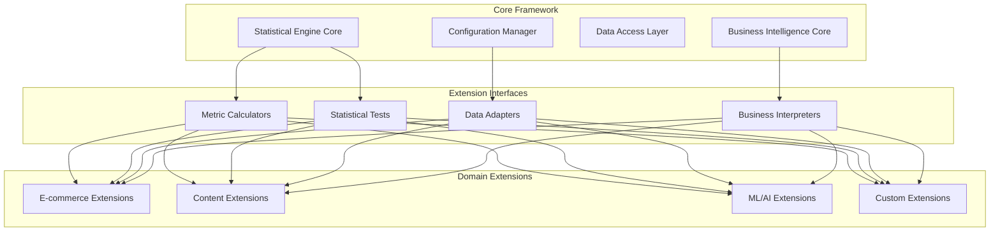

# Extensibility Guide for A/B Testing Platform

**Version:** 1.0.0  
**Last Updated:** September 10, 2025  
**Authors:** Data Science & Engineering Teams  

Comprehensive guide for extending the A/B testing platform to support new experiment domains, metrics, and statistical methods.

## Table of Contents

- [Overview](#overview)
- [Architecture for Extensibility](#architecture-for-extensibility)
- [Adding New Experiment Domains](#adding-new-experiment-domains)
- [Adding New Metrics](#adding-new-metrics)
- [Adding New Statistical Methods](#adding-new-statistical-methods)
- [Extending Data Pipeline](#extending-data-pipeline)
- [Plugin Architecture](#plugin-architecture)
- [Best Practices](#best-practices)

## Overview

The A/B testing platform is designed for extensibility from the ground up. This guide provides comprehensive instructions for extending the platform to support new business domains, metrics, statistical methods, and data sources while maintaining statistical rigor and system reliability.

### Extensibility Principles

1. **Plugin Architecture**: Core framework with pluggable components
2. **Interface Contracts**: Well-defined interfaces for all extension points
3. **Backward Compatibility**: Extensions don't break existing functionality
4. **Configuration-Driven**: New capabilities exposed through configuration
5. **Test-Driven Extension**: All extensions include comprehensive tests

## Architecture for Extensibility

### Core Extension Points



### Extension Registry Pattern

```python
# Core extension registry
class ExtensionRegistry:
    """
    Central registry for all platform extensions
    
    Manages registration, discovery, and lifecycle of extensions
    """
    
    def __init__(self):
        self._metric_calculators = {}
        self._statistical_tests = {}
        self._data_adapters = {}
        self._business_interpreters = {}
    
    def register_metric_calculator(
        self, 
        metric_name: str, 
        calculator_class: Type[MetricCalculator]
    ) -> None:
        """Register new metric calculation method"""
        self._metric_calculators[metric_name] = calculator_class
    
    def register_statistical_test(
        self, 
        test_name: str, 
        test_class: Type[StatisticalTest]
    ) -> None:
        """Register new statistical test method"""
        self._statistical_tests[test_name] = test_class
    
    def register_data_adapter(
        self, 
        source_name: str, 
        adapter_class: Type[DataAdapter]
    ) -> None:
        """Register new data source adapter"""
        self._data_adapters[source_name] = adapter_class
    
    def register_business_interpreter(
        self, 
        domain_name: str, 
        interpreter_class: Type[BusinessInterpreter]
    ) -> None:
        """Register new business domain interpreter"""
        self._business_interpreters[domain_name] = interpreter_class
    
    def get_metric_calculator(self, metric_name: str) -> MetricCalculator:
        """Retrieve metric calculator by name"""
        if metric_name not in self._metric_calculators:
            raise ExtensionNotFoundError(f"Metric calculator '{metric_name}' not found")
        return self._metric_calculators[metric_name]()
    
    def list_available_extensions(self) -> Dict[str, List[str]]:
        """List all available extensions by category"""
        return {
            'metrics': list(self._metric_calculators.keys()),
            'statistical_tests': list(self._statistical_tests.keys()),
            'data_adapters': list(self._data_adapters.keys()),
            'business_interpreters': list(self._business_interpreters.keys())
        }

# Global registry instance
extension_registry = ExtensionRegistry()
```

## Adding New Experiment Domains

### Domain Extension Framework

#### 1. Define Domain Interface

```python
# Base interface for domain extensions
from abc import ABC, abstractmethod
from typing import Dict, List, Any

class ExperimentDomain(ABC):
    """
    Abstract base class for experiment domain extensions
    
    Each domain (e-commerce, content, ML, etc.) implements this interface
    """
    
    @property
    @abstractmethod
    def domain_name(self) -> str:
        """Unique identifier for this domain"""
        pass
    
    @property
    @abstractmethod
    def supported_metrics(self) -> List[str]:
        """List of metrics supported by this domain"""
        pass
    
    @property
    @abstractmethod
    def default_statistical_tests(self) -> List[str]:
        """Default statistical tests for this domain"""
        pass
    
    @abstractmethod
    def validate_experiment_config(self, config: Dict) -> List[str]:
        """Validate experiment configuration for this domain"""
        pass
    
    @abstractmethod
    def get_data_requirements(self, experiment_config: Dict) -> Dict[str, Any]:
        """Define data requirements for experiments in this domain"""
        pass
    
    @abstractmethod
    def interpret_results(
        self, 
        statistical_results: Dict, 
        experiment_config: Dict
    ) -> Dict[str, Any]:
        """Provide domain-specific interpretation of results"""
        pass
```

#### 2. Implement Domain Extension

```python
# Example: Content/Media domain extension
class ContentExperimentDomain(ExperimentDomain):
    """
    Content domain extension for content recommendation, 
    engagement optimization, and media consumption experiments
    """
    
    @property
    def domain_name(self) -> str:
        return "content"
    
    @property
    def supported_metrics(self) -> List[str]:
        return [
            "content_engagement_rate",
            "time_spent_consuming_content", 
            "content_completion_rate",
            "content_sharing_rate",
            "content_bookmark_rate",
            "content_discovery_efficiency"
        ]
    
    @property
    def default_statistical_tests(self) -> List[str]:
        return ["welch_ttest", "mann_whitney_u", "chi_square"]
    
    def validate_experiment_config(self, config: Dict) -> List[str]:
        """Validate content domain experiment configuration"""
        errors = []
        
        # Content-specific validation
        if 'content_type' not in config.get('design', {}):
            errors.append("Content experiments must specify content_type")
        
        valid_content_types = ['article', 'video', 'podcast', 'interactive']
        content_type = config.get('design', {}).get('content_type')
        if content_type and content_type not in valid_content_types:
            errors.append(f"Invalid content_type: {content_type}")
        
        # Validate content-specific metrics
        primary_metric = config.get('metrics', {}).get('primary', {}).get('name')
        if primary_metric and primary_metric not in self.supported_metrics:
            errors.append(f"Unsupported content metric: {primary_metric}")
        
        return errors
    
    def get_data_requirements(self, experiment_config: Dict) -> Dict[str, Any]:
        """Define data requirements for content experiments"""
        return {
            'required_tables': [
                'content_interactions',
                'content_metadata', 
                'user_content_preferences'
            ],
            'required_columns': {
                'content_interactions': [
                    'user_id', 'content_id', 'interaction_type',
                    'interaction_timestamp', 'session_id'
                ],
                'content_metadata': [
                    'content_id', 'content_type', 'content_category',
                    'content_length', 'publication_date'
                ]
            },
            'minimum_history_days': 30,
            'minimum_interactions_per_user': 5
        }
    
    def interpret_results(
        self, 
        statistical_results: Dict, 
        experiment_config: Dict
    ) -> Dict[str, Any]:
        """Provide content domain-specific interpretation"""
        interpretation = {
            'domain': 'content',
            'business_context': {},
            'actionable_insights': [],
            'content_recommendations': []
        }
        
        effect_size = statistical_results.get('effect_sizes', {}).get('relative_lift_percent', 0)
        p_value = statistical_results.get('significance_tests', {}).get('welch_ttest', {}).get('p_value', 1.0)
        
        # Content-specific interpretation logic
        if p_value < 0.05 and effect_size > 0.05:  # 5% improvement
            interpretation['business_context']['impact_assessment'] = 'positive_content_engagement'
            interpretation['actionable_insights'].append(
                f"Content engagement improved by {effect_size:.1%}, "
                "consider rolling out to all content types"
            )
        
        # Content-specific recommendations
        content_type = experiment_config.get('design', {}).get('content_type')
        if content_type == 'video' and effect_size > 0.10:
            interpretation['content_recommendations'].append(
                "Strong video engagement lift suggests investing in video content production"
            )
        
        return interpretation
```

#### 3. Register Domain Extension

```python
# Register the content domain
extension_registry.register_business_interpreter('content', ContentExperimentDomain)

# Usage in experiments
content_domain = extension_registry.get_business_interpreter('content')
validation_errors = content_domain.validate_experiment_config(experiment_config)
```

### Domain Configuration Schema

```yaml
# Example content domain experiment configuration
content_recommendation_test_v1_0_0:
  design:
    experiment_name: "content_recommendation_test_v1_0_0"
    version: "1.0.0"
    domain: "content"  # Specifies domain extension to use
    content_type: "video"
    description: "Test personalized vs. trending video recommendations"
  
  metrics:
    primary:
      name: "content_engagement_rate"
      definition: "engaged_sessions / total_sessions"
      business_significance_threshold: 0.10
    
    secondary:
      - name: "time_spent_consuming_content"
        definition: "total_watch_time_minutes / total_sessions"
        guardrail_threshold: -0.05
      
      - name: "content_completion_rate"
        definition: "completed_videos / started_videos"
        target_direction: "increase"
  
  population:
    eligibility_criteria:
      include:
        content_consumers: ["active_viewers", "casual_browsers"]
        engagement_level: ["low", "medium", "high"]
      exclude:
        content_creators: true
        premium_subscribers: false  # Include premium users
  
  domain_specific:
    content_categories: ["entertainment", "education", "news"]
    recommendation_algorithm: "collaborative_filtering"
    baseline_algorithm: "trending_content"
```

## Adding New Metrics

### Metric Calculator Interface

```python
# Base interface for metric calculators
class MetricCalculator(ABC):
    """
    Abstract base class for metric calculation implementations
    
    Each metric type implements this interface for standardized calculation
    """
    
    @property
    @abstractmethod
    def metric_name(self) -> str:
        """Unique identifier for this metric"""
        pass
    
    @property
    @abstractmethod
    def metric_type(self) -> str:
        """Type of metric: 'proportion', 'continuous', 'count', 'time'"""
        pass
    
    @property
    @abstractmethod
    def required_columns(self) -> List[str]:
        """Data columns required for metric calculation"""
        pass
    
    @abstractmethod
    def calculate(self, data: pd.DataFrame, **kwargs) -> pd.Series:
        """
        Calculate metric values for each experimental unit
        
        Args:
            data: DataFrame with experiment data
            **kwargs: Additional calculation parameters
            
        Returns:
            Series with metric values indexed by experimental unit
        """
        pass
    
    @abstractmethod
    def validate_data(self, data: pd.DataFrame) -> List[str]:
        """
        Validate data meets requirements for metric calculation
        
        Returns:
            List of validation errors (empty if valid)
        """
        pass
    
    def aggregate(self, metric_values: pd.Series, aggregation: str = 'mean') -> float:
        """
        Aggregate metric values across experimental units
        
        Common aggregations: mean, median, sum, count
        """
        aggregation_methods = {
            'mean': metric_values.mean,
            'median': metric_values.median,
            'sum': metric_values.sum,
            'count': metric_values.count,
            'std': metric_values.std
        }
        
        if aggregation not in aggregation_methods:
            raise ValueError(f"Unsupported aggregation: {aggregation}")
        
        return aggregation_methods[aggregation]()
```

### Example: Custom Engagement Metric

```python
# Example: Content engagement score metric
class ContentEngagementScoreCalculator(MetricCalculator):
    """
    Calculate composite content engagement score based on multiple interactions
    
    Combines view time, shares, likes, comments into single engagement metric
    """
    
    @property
    def metric_name(self) -> str:
        return "content_engagement_score"
    
    @property
    def metric_type(self) -> str:
        return "continuous"
    
    @property
    def required_columns(self) -> List[str]:
        return [
            'user_id',
            'view_time_seconds',
            'num_shares',
            'num_likes', 
            'num_comments',
            'content_length_seconds'
        ]
    
    def calculate(self, data: pd.DataFrame, **kwargs) -> pd.Series:
        """
        Calculate engagement score using weighted combination of interactions
        
        Score = (normalized_view_time * 0.4) + 
                (shares * 0.3) + 
                (likes * 0.2) + 
                (comments * 0.1)
        """
        # Validate required columns exist
        validation_errors = self.validate_data(data)
        if validation_errors:
            raise ValueError(f"Data validation failed: {validation_errors}")
        
        # Calculate normalized view time (0-1 scale)
        data['view_completion_rate'] = np.minimum(
            data['view_time_seconds'] / data['content_length_seconds'], 
            1.0
        )
        
        # Calculate engagement score with configurable weights
        weights = kwargs.get('weights', {
            'view_time': 0.4,
            'shares': 0.3,
            'likes': 0.2,
            'comments': 0.1
        })
        
        engagement_score = (
            data['view_completion_rate'] * weights['view_time'] +
            np.log1p(data['num_shares']) * weights['shares'] +  # Log transform for shares
            np.log1p(data['num_likes']) * weights['likes'] +    # Log transform for likes
            np.log1p(data['num_comments']) * weights['comments'] # Log transform for comments
        )
        
        return engagement_score.fillna(0)  # Handle missing values
    
    def validate_data(self, data: pd.DataFrame) -> List[str]:
        """Validate data for engagement score calculation"""
        errors = []
        
        # Check required columns
        missing_columns = [col for col in self.required_columns if col not in data.columns]
        if missing_columns:
            errors.append(f"Missing required columns: {missing_columns}")
        
        # Check data quality
        if 'view_time_seconds' in data.columns:
            if (data['view_time_seconds'] < 0).any():
                errors.append("Negative view times found")
        
        if 'content_length_seconds' in data.columns:
            if (data['content_length_seconds'] <= 0).any():
                errors.append("Invalid content lengths found")
        
        # Check for reasonable data ranges
        numeric_columns = ['num_shares', 'num_likes', 'num_comments']
        for col in numeric_columns:
            if col in data.columns and (data[col] < 0).any():
                errors.append(f"Negative values found in {col}")
        
        return errors

# Register the metric calculator
extension_registry.register_metric_calculator(
    'content_engagement_score', 
    ContentEngagementScoreCalculator
)
```

### Using Custom Metrics in Experiments

```yaml
# Experiment configuration using custom metric
content_personalization_test:
  metrics:
    primary:
      name: "content_engagement_score"  # Custom metric
      definition: "Composite engagement score from views, shares, likes, comments"
      calculation_parameters:
        weights:
          view_time: 0.5
          shares: 0.25
          likes: 0.15
          comments: 0.10
      business_significance_threshold: 0.15
    
    secondary:
      - name: "session_duration"
        definition: "total_session_time_minutes"
        target_direction: "increase"
```

## Adding New Statistical Methods

### Statistical Test Interface

```python
# Base interface for statistical tests
class StatisticalTest(ABC):
    """
    Abstract base class for statistical test implementations
    
    Supports both frequentist and Bayesian approaches
    """
    
    @property
    @abstractmethod
    def test_name(self) -> str:
        """Unique identifier for this test"""
        pass
    
    @property
    @abstractmethod
    def test_type(self) -> str:
        """Type: 'parametric', 'non_parametric', 'bayesian'"""
        pass
    
    @property
    @abstractmethod
    def supported_data_types(self) -> List[str]:
        """Data types this test supports: 'continuous', 'proportion', 'count'"""
        pass
    
    @abstractmethod
    def run_test(
        self, 
        control_data: np.ndarray, 
        treatment_data: np.ndarray,
        **kwargs
    ) -> StatisticalTestResult:
        """
        Execute statistical test
        
        Returns:
            StatisticalTestResult with p_value, test_statistic, 
            confidence_intervals, etc.
        """
        pass
    
    @abstractmethod
    def check_assumptions(
        self, 
        control_data: np.ndarray, 
        treatment_data: np.ndarray
    ) -> AssumptionCheckResult:
        """
        Check test assumptions and provide warnings if violated
        """
        pass
    
    def calculate_power(
        self,
        effect_size: float,
        sample_size: int,
        alpha: float = 0.05
    ) -> float:
        """Calculate statistical power for given parameters"""
        # Default implementation - can be overridden
        pass
```

### Example: Bayesian A/B Test

```python
# Example: Bayesian statistical test implementation
import pymc as pm
import arviz as az
from scipy import stats

class BayesianABTest(StatisticalTest):
    """
    Bayesian A/B test using Beta-Binomial model for proportions
    or Normal model for continuous metrics
    """
    
    @property
    def test_name(self) -> str:
        return "bayesian_ab_test"
    
    @property
    def test_type(self) -> str:
        return "bayesian"
    
    @property
    def supported_data_types(self) -> List[str]:
        return ["proportion", "continuous"]
    
    def run_test(
        self, 
        control_data: np.ndarray, 
        treatment_data: np.ndarray,
        **kwargs
    ) -> StatisticalTestResult:
        """
        Run Bayesian A/B test with MCMC sampling
        """
        data_type = kwargs.get('data_type', 'continuous')
        prior_params = kwargs.get('prior_params', {})
        mcmc_samples = kwargs.get('mcmc_samples', 2000)
        
        if data_type == 'proportion':
            return self._run_beta_binomial_test(
                control_data, treatment_data, prior_params, mcmc_samples
            )
        elif data_type == 'continuous':
            return self._run_normal_test(
                control_data, treatment_data, prior_params, mcmc_samples
            )
        else:
            raise ValueError(f"Unsupported data type for Bayesian test: {data_type}")
    
    def _run_beta_binomial_test(
        self,
        control_data: np.ndarray,
        treatment_data: np.ndarray,
        prior_params: Dict,
        mcmc_samples: int
    ) -> StatisticalTestResult:
        """Bayesian test for proportion data using Beta-Binomial model"""
        
        # Data preparation
        control_successes = int(np.sum(control_data))
        control_trials = len(control_data)
        treatment_successes = int(np.sum(treatment_data))
        treatment_trials = len(treatment_data)
        
        # Prior parameters (default to uninformative)
        alpha_prior = prior_params.get('alpha', 1)
        beta_prior = prior_params.get('beta', 1)
        
        with pm.Model() as model:
            # Priors for conversion rates
            p_control = pm.Beta('p_control', alpha=alpha_prior, beta=beta_prior)
            p_treatment = pm.Beta('p_treatment', alpha=alpha_prior, beta=beta_prior)
            
            # Likelihood
            obs_control = pm.Binomial('obs_control', n=control_trials, p=p_control, observed=control_successes)
            obs_treatment = pm.Binomial('obs_treatment', n=treatment_trials, p=p_treatment, observed=treatment_successes)
            
            # Derived quantities
            lift = pm.Deterministic('lift', p_treatment - p_control)
            relative_lift = pm.Deterministic('relative_lift', (p_treatment - p_control) / p_control)
            
            # Sample from posterior
            trace = pm.sample(mcmc_samples, return_inferencedata=True)
        
        # Extract results
        lift_samples = trace.posterior['lift'].values.flatten()
        relative_lift_samples = trace.posterior['relative_lift'].values.flatten()
        
        # Calculate Bayesian metrics
        prob_improvement = np.mean(lift_samples > 0)
        prob_significant_improvement = np.mean(lift_samples > 0.01)  # 1% absolute improvement
        
        # Credible intervals
        lift_ci = np.percentile(lift_samples, [2.5, 97.5])
        relative_lift_ci = np.percentile(relative_lift_samples, [2.5, 97.5])
        
        return StatisticalTestResult(
            test_name=self.test_name,
            p_value=1 - prob_improvement,  # Convert to frequentist-like p-value
            test_statistic=np.mean(lift_samples),
            confidence_intervals={
                'lift': lift_ci,
                'relative_lift': relative_lift_ci
            },
            effect_sizes={
                'absolute_lift': np.mean(lift_samples),
                'relative_lift': np.mean(relative_lift_samples)
            },
            bayesian_metrics={
                'probability_of_improvement': prob_improvement,
                'probability_of_significant_improvement': prob_significant_improvement,
                'posterior_samples': {
                    'lift': lift_samples,
                    'relative_lift': relative_lift_samples
                }
            },
            additional_info={
                'model_convergence': az.rhat(trace).max().values,
                'effective_sample_size': az.ess(trace).min().values
            }
        )
    
    def check_assumptions(
        self, 
        control_data: np.ndarray, 
        treatment_data: np.ndarray
    ) -> AssumptionCheckResult:
        """
        Check assumptions for Bayesian test
        
        Bayesian tests are generally more robust to assumption violations
        """
        warnings = []
        
        # Check sample sizes
        if len(control_data) < 50 or len(treatment_data) < 50:
            warnings.append("Small sample sizes may lead to wide credible intervals")
        
        # Check for extreme proportions (for proportion data)
        if np.all(control_data == 0) or np.all(control_data == 1):
            warnings.append("Extreme proportions in control group may affect convergence")
        
        if np.all(treatment_data == 0) or np.all(treatment_data == 1):
            warnings.append("Extreme proportions in treatment group may affect convergence")
        
        return AssumptionCheckResult(
            assumptions_met=len(warnings) == 0,
            warnings=warnings,
            recommendations=[
                "Consider using informative priors if you have domain knowledge",
                "Increase MCMC samples if convergence diagnostics are poor"
            ]
        )

# Register the Bayesian test
extension_registry.register_statistical_test('bayesian_ab_test', BayesianABTest)
```

### Using Custom Statistical Methods

```yaml
# Experiment configuration with Bayesian analysis
advanced_personalization_test:
  statistical_design:
    primary_analysis_method: "bayesian_ab_test"
    analysis_parameters:
      data_type: "proportion"
      mcmc_samples: 5000
      prior_params:
        alpha: 2  # Slightly informative prior
        beta: 18  # Expecting ~10% baseline conversion
    
    fallback_analysis_method: "welch_ttest"  # Frequentist fallback
    
    decision_criteria:
      bayesian_threshold: 0.95  # 95% probability of improvement
      minimum_effect_size: 0.02  # 2% absolute improvement
```

## Extending Data Pipeline

### Data Adapter Interface

```python
# Base interface for data adapters
class DataAdapter(ABC):
    """
    Abstract base class for data source adapters
    
    Enables integration with different data sources and formats
    """
    
    @property
    @abstractmethod
    def adapter_name(self) -> str:
        """Unique identifier for this adapter"""
        pass
    
    @property
    @abstractmethod
    def supported_sources(self) -> List[str]:
        """List of data sources this adapter supports"""
        pass
    
    @abstractmethod
    def connect(self, connection_config: Dict) -> bool:
        """Establish connection to data source"""
        pass
    
    @abstractmethod
    def extract_experiment_data(
        self, 
        experiment_config: Dict,
        date_range: Tuple[str, str]
    ) -> pd.DataFrame:
        """Extract data for experiment analysis"""
        pass
    
    @abstractmethod
    def validate_data_schema(self, data: pd.DataFrame) -> List[str]:
        """Validate data meets expected schema"""
        pass
    
    @abstractmethod
    def transform_to_standard_schema(self, data: pd.DataFrame) -> pd.DataFrame:
        """Transform data to standard experiment schema"""
        pass
```

### Example: Snowflake Data Adapter

```python
# Example: Snowflake data warehouse adapter
import snowflake.connector
from snowflake.connector.pandas_tools import write_pandas

class SnowflakeDataAdapter(DataAdapter):
    """
    Data adapter for Snowflake data warehouse
    
    Enables experiments on data stored in Snowflake
    """
    
    def __init__(self):
        self.connection = None
        self.cursor = None
    
    @property
    def adapter_name(self) -> str:
        return "snowflake"
    
    @property
    def supported_sources(self) -> List[str]:
        return ["snowflake_warehouse", "snowflake_database"]
    
    def connect(self, connection_config: Dict) -> bool:
        """Connect to Snowflake warehouse"""
        try:
            self.connection = snowflake.connector.connect(
                user=connection_config['user'],
                password=connection_config['password'],
                account=connection_config['account'],
                warehouse=connection_config['warehouse'],
                database=connection_config['database'],
                schema=connection_config['schema']
            )
            self.cursor = self.connection.cursor()
            return True
        except Exception as e:
            print(f"Snowflake connection failed: {e}")
            return False
    
    def extract_experiment_data(
        self, 
        experiment_config: Dict,
        date_range: Tuple[str, str]
    ) -> pd.DataFrame:
        """Extract experiment data from Snowflake"""
        
        # Build query based on experiment configuration
        query = self._build_experiment_query(experiment_config, date_range)
        
        # Execute query and return DataFrame
        self.cursor.execute(query)
        results = self.cursor.fetchall()
        columns = [desc[0] for desc in self.cursor.description]
        
        return pd.DataFrame(results, columns=columns)
    
    def _build_experiment_query(
        self, 
        experiment_config: Dict, 
        date_range: Tuple[str, str]
    ) -> str:
        """Build Snowflake query for experiment data"""
        
        # Extract configuration parameters
        base_table = experiment_config.get('data_source', {}).get('base_table')
        primary_metric = experiment_config['metrics']['primary']['name']
        user_id_column = experiment_config.get('data_source', {}).get('user_id_column', 'user_id')
        
        # Map metric names to SQL expressions
        metric_expressions = {
            'conversion_rate': 'COUNT(CASE WHEN converted = 1 THEN 1 END) / COUNT(*)',
            'revenue_per_user': 'SUM(revenue) / COUNT(DISTINCT user_id)',
            'orders_per_user': 'COUNT(order_id) / COUNT(DISTINCT user_id)'
        }
        
        metric_sql = metric_expressions.get(
            primary_metric, 
            f'AVG({primary_metric})'  # Default aggregation
        )
        
        query = f"""
        SELECT 
            {user_id_column} as user_id,
            experiment_variant as variant,
            experiment_assignment_date as assignment_date,
            {metric_sql} as primary_metric_value
        FROM {base_table}
        WHERE experiment_assignment_date BETWEEN '{date_range[0]}' AND '{date_range[1]}'
          AND experiment_name = '{experiment_config['design']['experiment_name']}'
        GROUP BY user_id, variant, assignment_date
        """
        
        return query
    
    def validate_data_schema(self, data: pd.DataFrame) -> List[str]:
        """Validate Snowflake data schema"""
        errors = []
        
        required_columns = ['user_id', 'variant', 'assignment_date', 'primary_metric_value']
        missing_columns = [col for col in required_columns if col not in data.columns]
        
        if missing_columns:
            errors.append(f"Missing required columns: {missing_columns}")
        
        # Validate data types
        if 'user_id' in data.columns and not data['user_id'].dtype == 'object':
            errors.append("user_id must be string type")
        
        if 'primary_metric_value' in data.columns and not pd.api.types.is_numeric_dtype(data['primary_metric_value']):
            errors.append("primary_metric_value must be numeric")
        
        return errors
    
    def transform_to_standard_schema(self, data: pd.DataFrame) -> pd.DataFrame:
        """Transform Snowflake data to standard experiment schema"""
        
        # Standardize column names
        column_mapping = {
            'USER_ID': 'user_id',
            'VARIANT': 'variant', 
            'ASSIGNMENT_DATE': 'assignment_date',
            'PRIMARY_METRIC_VALUE': 'primary_metric_value'
        }
        
        data = data.rename(columns=column_mapping)
        
        # Standardize data types
        data['user_id'] = data['user_id'].astype(str)
        data['assignment_date'] = pd.to_datetime(data['assignment_date']).dt.date
        data['primary_metric_value'] = pd.to_numeric(data['primary_metric_value'], errors='coerce')
        
        return data

# Register the Snowflake adapter
extension_registry.register_data_adapter('snowflake', SnowflakeDataAdapter)
```

## Plugin Architecture

### Plugin Discovery and Loading

```python
# Plugin system for dynamic extension loading
class PluginManager:
    """
    Manages dynamic loading and unloading of plugins
    
    Supports both file-based and package-based plugins
    """
    
    def __init__(self, plugin_directories: List[str] = None):
        self.plugin_directories = plugin_directories or ['./plugins']
        self.loaded_plugins = {}
    
    def discover_plugins(self) -> List[str]:
        """Discover available plugins in plugin directories"""
        plugins = []
        
        for directory in self.plugin_directories:
            if os.path.exists(directory):
                for file in os.listdir(directory):
                    if file.endswith('_plugin.py'):
                        plugins.append(os.path.join(directory, file))
        
        return plugins
    
    def load_plugin(self, plugin_path: str) -> bool:
        """Load plugin from file path"""
        try:
            spec = importlib.util.spec_from_file_location("plugin", plugin_path)
            module = importlib.util.module_from_spec(spec)
            spec.loader.exec_module(module)
            
            # Plugin should have register_plugin function
            if hasattr(module, 'register_plugin'):
                module.register_plugin(extension_registry)
                self.loaded_plugins[plugin_path] = module
                return True
            else:
                print(f"Plugin {plugin_path} missing register_plugin function")
                return False
                
        except Exception as e:
            print(f"Failed to load plugin {plugin_path}: {e}")
            return False
    
    def load_all_plugins(self) -> int:
        """Load all discovered plugins"""
        plugins = self.discover_plugins()
        loaded_count = 0
        
        for plugin in plugins:
            if self.load_plugin(plugin):
                loaded_count += 1
        
        return loaded_count
    
    def unload_plugin(self, plugin_path: str) -> bool:
        """Unload previously loaded plugin"""
        if plugin_path in self.loaded_plugins:
            module = self.loaded_plugins[plugin_path]
            if hasattr(module, 'unregister_plugin'):
                module.unregister_plugin(extension_registry)
            del self.loaded_plugins[plugin_path]
            return True
        return False
```

### Example Plugin Implementation

```python
# plugins/ecommerce_metrics_plugin.py
"""
E-commerce specific metrics plugin

Provides common e-commerce metrics like AOV, cart abandonment, etc.
"""

from typing import List
import pandas as pd
import numpy as np

class AverageOrderValueCalculator(MetricCalculator):
    """Calculate average order value for e-commerce experiments"""
    
    @property
    def metric_name(self) -> str:
        return "average_order_value"
    
    @property
    def metric_type(self) -> str:
        return "continuous"
    
    @property
    def required_columns(self) -> List[str]:
        return ['user_id', 'order_value', 'order_count']
    
    def calculate(self, data: pd.DataFrame, **kwargs) -> pd.Series:
        """Calculate AOV per user"""
        user_aov = data.groupby('user_id').agg({
            'order_value': 'sum',
            'order_count': 'sum'
        })
        
        # AOV = total order value / number of orders
        aov = user_aov['order_value'] / user_aov['order_count']
        return aov.fillna(0)
    
    def validate_data(self, data: pd.DataFrame) -> List[str]:
        """Validate AOV calculation data"""
        errors = []
        
        if 'order_value' in data.columns and (data['order_value'] < 0).any():
            errors.append("Negative order values found")
        
        if 'order_count' in data.columns and (data['order_count'] < 0).any():
            errors.append("Negative order counts found")
        
        return errors

class CartAbandonmentRateCalculator(MetricCalculator):
    """Calculate cart abandonment rate"""
    
    @property
    def metric_name(self) -> str:
        return "cart_abandonment_rate"
    
    @property
    def metric_type(self) -> str:
        return "proportion"
    
    @property
    def required_columns(self) -> List[str]:
        return ['user_id', 'cart_created', 'purchase_completed']
    
    def calculate(self, data: pd.DataFrame, **kwargs) -> pd.Series:
        """Calculate cart abandonment rate per user"""
        user_stats = data.groupby('user_id').agg({
            'cart_created': 'sum',
            'purchase_completed': 'sum'
        })
        
        # Abandonment rate = (carts created - purchases) / carts created
        abandonment_rate = (
            (user_stats['cart_created'] - user_stats['purchase_completed']) / 
            user_stats['cart_created']
        )
        
        return abandonment_rate.fillna(0).clip(0, 1)  # Ensure 0-1 range
    
    def validate_data(self, data: pd.DataFrame) -> List[str]:
        """Validate cart abandonment data"""
        errors = []
        
        # Check that purchases don't exceed cart creations
        invalid_data = data['purchase_completed'] > data['cart_created']
        if invalid_data.any():
            errors.append("Purchases exceed cart creations for some users")
        
        return errors

# Plugin registration function
def register_plugin(registry):
    """Register e-commerce metrics with the extension registry"""
    registry.register_metric_calculator('average_order_value', AverageOrderValueCalculator)
    registry.register_metric_calculator('cart_abandonment_rate', CartAbandonmentRateCalculator)
    print("E-commerce metrics plugin registered successfully")

def unregister_plugin(registry):
    """Unregister e-commerce metrics from the extension registry"""
    # Implementation would remove from registry
    print("E-commerce metrics plugin unregistered")
```

## Best Practices

### Extension Development Guidelines

#### 1. Interface Compliance
```python
# Always implement required interfaces completely
class MyCustomMetric(MetricCalculator):
    # Implement ALL abstract methods
    # Don't skip validation or error handling
    pass
```

#### 2. Comprehensive Testing
```python
# tests/test_custom_extensions.py
def test_custom_metric_calculator():
    """Test custom metric calculator thoroughly"""
    calculator = MyCustomMetricCalculator()
    
    # Test with valid data
    valid_data = create_valid_test_data()
    result = calculator.calculate(valid_data)
    assert len(result) > 0
    
    # Test with invalid data
    invalid_data = create_invalid_test_data()
    errors = calculator.validate_data(invalid_data)
    assert len(errors) > 0
    
    # Test edge cases
    empty_data = pd.DataFrame()
    errors = calculator.validate_data(empty_data)
    assert "Missing required columns" in str(errors)
```

#### 3. Configuration Validation
```python
# Always validate extension-specific configuration
def validate_extension_config(config: Dict) -> List[str]:
    """Validate configuration for custom extensions"""
    errors = []
    
    # Check required extension parameters
    if 'custom_parameters' not in config:
        errors.append("Missing custom_parameters section")
    
    # Validate parameter values
    custom_params = config.get('custom_parameters', {})
    if 'threshold' in custom_params:
        threshold = custom_params['threshold']
        if not 0 <= threshold <= 1:
            errors.append("Threshold must be between 0 and 1")
    
    return errors
```

#### 4. Error Handling and Logging
```python
import logging

logger = logging.getLogger(__name__)

class RobustExtension:
    """Example of robust extension with proper error handling"""
    
    def process_data(self, data: pd.DataFrame) -> pd.DataFrame:
        """Process data with comprehensive error handling"""
        try:
            # Validate inputs
            if data.empty:
                logger.warning("Empty data provided to extension")
                return pd.DataFrame()
            
            # Process data
            result = self._internal_processing(data)
            
            # Validate outputs
            if result.empty:
                logger.warning("Extension produced empty result")
            
            return result
            
        except Exception as e:
            logger.error(f"Extension processing failed: {e}")
            # Return safe default or re-raise based on severity
            return pd.DataFrame()
```

#### 5. Performance Considerations
```python
# Optimize for large datasets
class PerformantExtension:
    
    def calculate_metric(self, data: pd.DataFrame) -> pd.Series:
        """Calculate metric with performance optimizations"""
        
        # Use vectorized operations
        result = data.groupby('user_id')['metric_column'].agg('mean')
        
        # Avoid loops when possible
        # Use pandas/numpy native functions
        # Consider chunking for very large datasets
        
        return result
    
    def calculate_metric_chunked(
        self, 
        data: pd.DataFrame, 
        chunk_size: int = 10000
    ) -> pd.Series:
        """Calculate metric in chunks for large datasets"""
        
        results = []
        for chunk in pd.read_csv(data, chunksize=chunk_size):
            chunk_result = self.calculate_metric(chunk)
            results.append(chunk_result)
        
        return pd.concat(results)
```

---

**This extensibility guide provides a comprehensive framework for extending the A/B testing platform while maintaining code quality, performance, and reliability. All extensions should follow these patterns to ensure seamless integration with the core platform.**

---

**Documentation Version:** 1.0.0 | **Framework Version:** 1.0.0