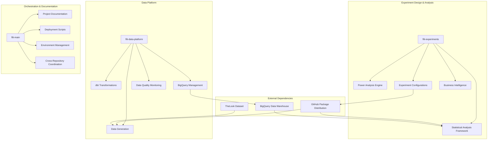
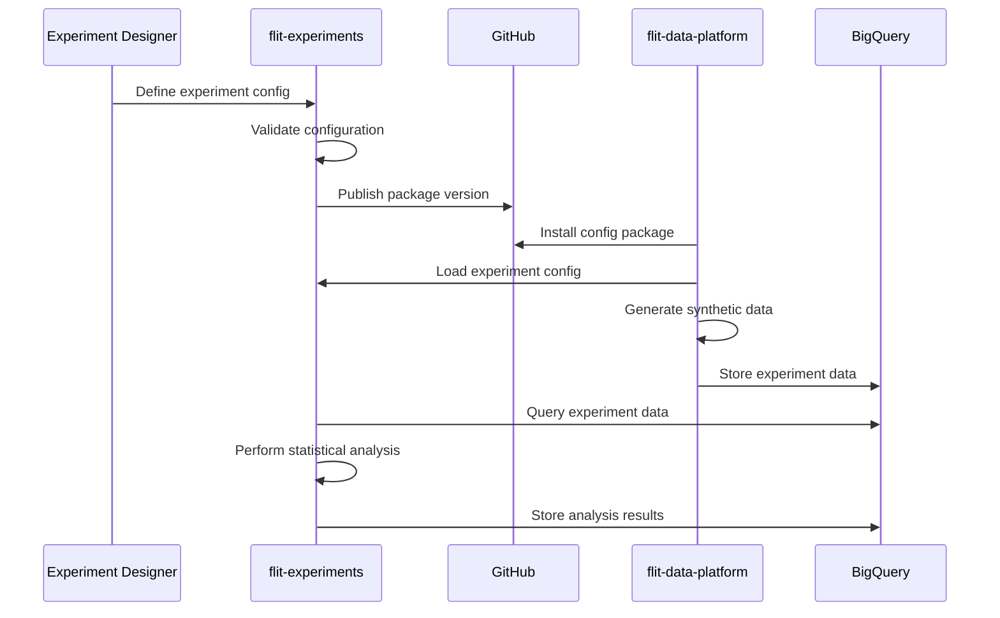
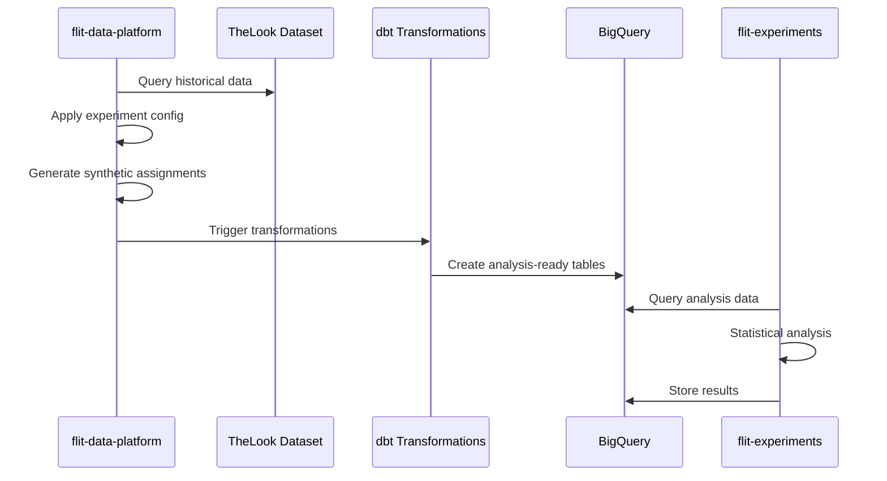
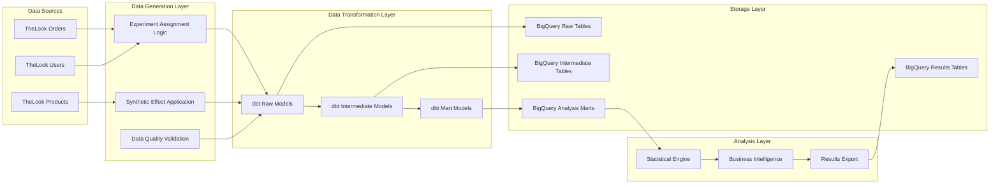

# System Design for A/B Testing Platform

**Version:** 1.0.0  
**Last Updated:** September 10, 2025  
**Authors:** Data Science & Engineering Teams  

Comprehensive system design documentation for the multi-repository A/B testing platform architecture.

## Table of Contents

- [Overview](#overview)
- [Multi-Repository Architecture](#multi-repository-architecture)
- [Service Boundaries](#service-boundaries)
- [Data Flow Architecture](#data-flow-architecture)
- [Integration Patterns](#integration-patterns)
- [Scalability Considerations](#scalability-considerations)
- [Deployment Architecture](#deployment-architecture)

## Overview

The A/B testing platform follows a distributed microservices architecture across multiple repositories, each with clear responsibilities and well-defined interfaces. This design enables independent development, deployment, and scaling while maintaining statistical rigor and business alignment.

### Design Principles

1. **Separation of Concerns**: Each repository has a single, well-defined responsibility
2. **Configuration as a Service**: Experiment specifications are packaged and versioned
3. **Data Pipeline Isolation**: Statistical analysis is decoupled from data generation
4. **Reproducible Science**: Every analysis can be exactly replicated
5. **Scalable by Design**: Architecture supports growth in experiments and data volume

## Multi-Repository Architecture

### Repository Ecosystem



### Repository Responsibilities

#### flit-experiments (Experimentation Engine)
**Primary Role**: Experiment design, statistical analysis, and business decision making

**Core Components**:
- **Power Analysis Engine**: Sample size calculation and feasibility assessment
- **Statistical Analysis Framework**: Hypothesis testing and effect size estimation
- **Configuration Management**: Experiment specification packaging and distribution
- **Business Intelligence**: Decision frameworks and BigQuery integration

**Technology Stack**:
- Python 3.11+ with scientific computing libraries (SciPy, StatsModels, Pandas)
- YAML-based configuration management
- BigQuery client for data access
- GitHub-based package distribution

#### flit-data-platform (Data Engineering)
**Primary Role**: Data generation, transformation, and warehouse management

**Core Components**:
- **Synthetic Data Generation**: Creates realistic experiment data from TheLook dataset
- **dbt Transformations**: Data modeling and business logic implementation
- **BigQuery Management**: Schema design and data warehouse operations
- **Data Quality Monitoring**: Validation and anomaly detection

**Technology Stack**:
- Python 3.11+ for data generation
- dbt for data transformations
- BigQuery as data warehouse
- Apache Airflow for orchestration (future)

#### flit-main (Orchestration & Documentation)
**Primary Role**: Cross-repository coordination and project management

**Core Components**:
- **Project Documentation**: High-level architecture and getting started guides
- **Deployment Scripts**: Environment setup and configuration management
- **Integration Testing**: End-to-end validation across repositories
- **Release Coordination**: Synchronized releases across the ecosystem

**Technology Stack**:
- Documentation frameworks (Markdown, potentially GitBook)
- Docker for environment standardization
- GitHub Actions for CI/CD coordination

## Service Boundaries

### Interface Design

#### Configuration Distribution Interface

```python
# flit-experiments publishes configurations
# flit-data-platform and analysis frameworks consume

class ExperimentConfig:
    """
    Standardized interface for experiment configurations
    
    Published by flit-experiments, consumed by other services
    """
    
    @staticmethod
    def get_experiment_config(experiment_name: str) -> Dict:
        """Load experiment configuration by name"""
        pass
    
    @staticmethod
    def list_available_experiments() -> List[str]:
        """Get all available experiment configurations"""
        pass
    
    @staticmethod
    def validate_experiment_config(config: Dict) -> bool:
        """Validate experiment configuration structure"""
        pass
```

#### Data Contract Interface

```python
# flit-data-platform produces data
# flit-experiments consumes data

class ExperimentDataContract:
    """
    Standardized data schema for experiment analysis
    
    Produced by flit-data-platform, consumed by flit-experiments
    """
    
    required_columns = [
        'user_id',
        'variant', 
        'assignment_date',
        'primary_metric_value'
    ]
    
    optional_columns = [
        'secondary_metrics',
        'user_attributes',
        'experiment_metadata'
    ]
    
    @staticmethod
    def validate_experiment_data(df: pd.DataFrame) -> bool:
        """Validate data meets analysis requirements"""
        pass
```

#### Analysis Results Interface

```python
# flit-experiments produces analysis results
# External systems consume results

class AnalysisResults:
    """
    Standardized analysis output format
    
    Produced by flit-experiments, consumed by dashboards/reporting
    """
    
    @staticmethod
    def export_to_bigquery(results: Dict, table_name: str) -> bool:
        """Export analysis results to BigQuery"""
        pass
    
    @staticmethod
    def generate_executive_summary(results: Dict) -> str:
        """Generate business-readable summary"""
        pass
```

### Communication Patterns

#### Configuration-Driven Communication



#### Data Pipeline Communication



## Data Flow Architecture

### End-to-End Data Flow



### Data Layer Specifications

#### Raw Data Layer
**Purpose**: Immutable source of truth
**Retention**: Indefinite for audit trail
**Schema**: Event-level granularity

```sql
-- Raw experiment assignments
CREATE TABLE `raw.experiment_assignments` (
    assignment_id STRING,
    user_id STRING,
    experiment_name STRING,
    variant STRING,
    assignment_timestamp TIMESTAMP,
    assignment_method STRING,
    _generated_at TIMESTAMP
);
```

#### Intermediate Data Layer
**Purpose**: Cleaned and validated business logic
**Retention**: 2 years for analysis reproducibility
**Schema**: User/session aggregated

```sql
-- User-level experiment participation
CREATE TABLE `intermediate.experiment_users` (
    experiment_name STRING,
    user_id STRING,
    variant STRING,
    assignment_date DATE,
    primary_metric_value FLOAT64,
    secondary_metrics JSON,
    user_attributes JSON,
    _processed_at TIMESTAMP
) PARTITION BY assignment_date;
```

#### Analysis Mart Layer
**Purpose**: Optimized for statistical analysis
**Retention**: 1 year active analysis
**Schema**: Experiment-specific structures

```sql
-- Analysis-ready experiment data
CREATE TABLE `marts.free_shipping_analysis` (
    user_id STRING,
    variant STRING,
    assignment_date DATE,
    orders_during_experiment INT64,
    revenue_during_experiment FLOAT64,
    is_active_user BOOL,
    _analysis_ready_at TIMESTAMP
) PARTITION BY assignment_date CLUSTER BY variant;
```

## Integration Patterns

### Package-Based Integration

#### Configuration Package Distribution

```python
# setup.py in flit-experiments
setup(
    name="flit_experiment_configs",
    version="1.2.0",
    packages=find_packages(),
    package_data={
        'flit_experiment_configs': ['configs/*.yaml']
    }
)

# Installation in consuming services
# pip install git+https://github.com/whitehackr/flit-experiments.git@v1.2.0
```

#### Cross-Repository Dependency Management

```yaml
# flit-data-platform requirements.txt
flit_experiment_configs @ git+https://github.com/whitehackr/flit-experiments.git@v1.2.0

# flit-main requirements.txt  
flit_experiment_configs @ git+https://github.com/whitehackr/flit-experiments.git@v1.2.0
```

### API-Based Integration

#### Statistical Analysis API

```python
# flit-experiments exposes analysis capabilities
class StatisticalAnalysisAPI:
    
    @staticmethod
    def run_power_analysis(experiment_name: str, **kwargs) -> PowerAnalysisResult:
        """Run power analysis for experiment feasibility"""
        pass
    
    @staticmethod
    def analyze_experiment(experiment_name: str, **kwargs) -> AnalysisResult:
        """Perform complete statistical analysis"""
        pass
    
    @staticmethod
    def generate_business_report(analysis_result: AnalysisResult) -> BusinessReport:
        """Generate executive summary and recommendations"""
        pass
```

#### Data Generation API

```python
# flit-data-platform exposes data generation capabilities
class ExperimentDataAPI:
    
    @staticmethod
    def generate_experiment_data(
        experiment_name: str,
        start_date: str,
        end_date: str
    ) -> GenerationResult:
        """Generate synthetic experiment data"""
        pass
    
    @staticmethod
    def validate_data_quality(
        experiment_name: str,
        table_name: str
    ) -> DataQualityReport:
        """Validate generated data meets requirements"""
        pass
```

### Event-Driven Integration (Future Enhancement)

```python
# Event-driven communication pattern for real-time systems
class ExperimentEventBus:
    
    events = [
        'experiment.created',
        'experiment.started', 
        'experiment.data.generated',
        'experiment.analysis.completed',
        'experiment.decision.made'
    ]
    
    @staticmethod
    def publish_event(event_type: str, payload: Dict) -> None:
        """Publish experiment lifecycle events"""
        pass
    
    @staticmethod
    def subscribe_to_events(event_types: List[str], callback: Callable) -> None:
        """Subscribe to experiment events"""
        pass
```

## Scalability Considerations

### Horizontal Scaling Patterns

#### Data Processing Scalability

```python
# Parallelizable data generation design
class ScalableDataGeneration:
    
    @staticmethod
    def generate_data_partition(
        experiment_name: str,
        date_partition: str,
        user_segment: str
    ) -> None:
        """Generate data for specific partition - enables parallel processing"""
        pass
    
    @staticmethod
    def coordinate_parallel_generation(
        experiment_name: str,
        date_range: Tuple[str, str],
        parallelism: int = 10
    ) -> None:
        """Coordinate parallel data generation across multiple workers"""
        pass
```

#### Analysis Scalability

```python
# Scalable statistical analysis design
class ScalableAnalysis:
    
    @staticmethod
    def analyze_experiment_batch(
        experiment_names: List[str],
        parallel_workers: int = 5
    ) -> Dict[str, AnalysisResult]:
        """Analyze multiple experiments in parallel"""
        pass
    
    @staticmethod
    def stream_analysis_results(
        experiment_name: str,
        chunk_size: int = 1000
    ) -> Iterator[PartialResult]:
        """Stream large analysis results to prevent memory issues"""
        pass
```

### Vertical Scaling Considerations

#### Resource Optimization

```python
# Resource-efficient processing patterns
class ResourceOptimization:
    
    @staticmethod
    def optimize_bigquery_costs(query: str) -> str:
        """Optimize BigQuery queries for cost and performance"""
        # Add partition pruning
        # Add clustering optimizations
        # Limit data scanned
        pass
    
    @staticmethod
    def cache_expensive_computations(
        computation_key: str,
        computation_func: Callable,
        ttl_hours: int = 24
    ) -> Any:
        """Cache expensive computations with TTL"""
        pass
```

## Deployment Architecture

### Environment Strategy

#### Development Environment

```yaml
# docker-compose.dev.yml
version: '3.8'
services:
  flit-experiments:
    build: ./flit-experiments
    environment:
      - ENV=development
      - BIGQUERY_PROJECT=flit-dev
    volumes:
      - ./flit-experiments:/app
    
  flit-data-platform:
    build: ./flit-data-platform  
    environment:
      - ENV=development
      - DBT_PROFILES_DIR=/app/profiles
    volumes:
      - ./flit-data-platform:/app
```

#### Production Environment

```yaml
# kubernetes deployment example
apiVersion: apps/v1
kind: Deployment
metadata:
  name: flit-experiments-analysis
spec:
  replicas: 3
  selector:
    matchLabels:
      app: flit-experiments
  template:
    metadata:
      labels:
        app: flit-experiments
    spec:
      containers:
      - name: analysis-worker
        image: flit-experiments:v1.2.0
        env:
        - name: ENV
          value: "production"
        - name: BIGQUERY_PROJECT
          value: "flit-prod"
        resources:
          requests:
            cpu: 500m
            memory: 1Gi
          limits:
            cpu: 2000m
            memory: 4Gi
```

### CI/CD Pipeline Architecture

```mermaid
graph LR
    subgraph "Development"
        A1[Feature Branch]
        A2[Local Testing]
        A3[Pull Request]
    end
    
    subgraph "Continuous Integration"
        B1[Unit Tests]
        B2[Integration Tests]
        B3[Config Validation]
        B4[Cross-Repo Tests]
    end
    
    subgraph "Staging Deployment"
        C1[Deploy to Staging]
        C2[End-to-End Tests]
        C3[Performance Tests]
    end
    
    subgraph "Production Deployment"
        D1[Deploy to Production]
        D2[Health Checks]
        D3[Rollback Capability]
    end
    
    A1 --> A2 --> A3
    A3 --> B1 --> B2 --> B3 --> B4
    B4 --> C1 --> C2 --> C3
    C3 --> D1 --> D2 --> D3
```



### Security Architecture

#### Access Control Patterns

```python
# Repository-level access control
class SecurityArchitecture:
    
    repository_permissions = {
        'flit-experiments': {
            'data-scientists': ['read', 'write'],
            'analysts': ['read'],
            'engineers': ['read']
        },
        'flit-data-platform': {
            'data-engineers': ['read', 'write'],
            'data-scientists': ['read'],
            'analysts': ['read']
        },
        'flit-main': {
            'tech-leads': ['read', 'write'],
            'all-teams': ['read']
        }
    }
    
    @staticmethod
    def validate_access(user: str, repo: str, action: str) -> bool:
        """Validate user access to repository actions"""
        pass
```

#### Data Security Patterns

```python
# Data protection and compliance
class DataSecurity:
    
    @staticmethod
    def anonymize_user_data(df: pd.DataFrame) -> pd.DataFrame:
        """Anonymize PII in experimental data"""
        # Hash user IDs
        # Remove direct identifiers
        # Preserve statistical properties
        pass
    
    @staticmethod
    def audit_data_access(
        user: str,
        table: str,
        query: str,
        timestamp: datetime
    ) -> None:
        """Log all data access for compliance"""
        pass
```

---

## Monitoring and Observability

### System Health Monitoring

```python
# Cross-repository health monitoring
class SystemMonitoring:
    
    health_checks = [
        'bigquery_connectivity',
        'config_package_availability',
        'data_freshness',
        'analysis_pipeline_status'
    ]
    
    @staticmethod
    def check_system_health() -> Dict[str, str]:
        """Comprehensive system health check"""
        pass
    
    @staticmethod
    def alert_on_failures(health_status: Dict) -> None:
        """Send alerts for system failures"""
        pass
```

### Performance Monitoring

```python
# Performance tracking across repositories
class PerformanceMonitoring:
    
    @staticmethod
    def track_analysis_performance(
        experiment_name: str,
        start_time: datetime,
        end_time: datetime,
        resource_usage: Dict
    ) -> None:
        """Track analysis performance metrics"""
        pass
    
    @staticmethod
    def track_data_generation_performance(
        volume_processed: int,
        processing_time: float,
        error_rate: float
    ) -> None:
        """Track data generation performance"""
        pass
```

---

## Future Architecture Enhancements

### Real-Time Experiment Platform

```python
# Future: Real-time experiment assignment and analysis
class RealTimeExperimentPlatform:
    
    @staticmethod
    def assign_user_to_experiment(
        user_id: str,
        experiment_name: str
    ) -> ExperimentAssignment:
        """Real-time experiment assignment"""
        pass
    
    @staticmethod
    def stream_experiment_events(
        experiment_name: str
    ) -> Iterator[ExperimentEvent]:
        """Stream real-time experiment events"""
        pass
```

### Multi-Cloud Architecture

```python
# Future: Multi-cloud deployment capability
class MultiCloudArchitecture:
    
    cloud_providers = ['gcp', 'aws', 'azure']
    
    @staticmethod
    def deploy_to_cloud(
        provider: str,
        region: str,
        configuration: Dict
    ) -> DeploymentResult:
        """Deploy platform to multiple cloud providers"""
        pass
```

---

**This system design provides a scalable, maintainable, and extensible foundation for enterprise-grade A/B testing while maintaining clear separation of concerns and strong integration patterns.**

---

**Documentation Version:** 1.0.0 | **Framework Version:** 1.0.0