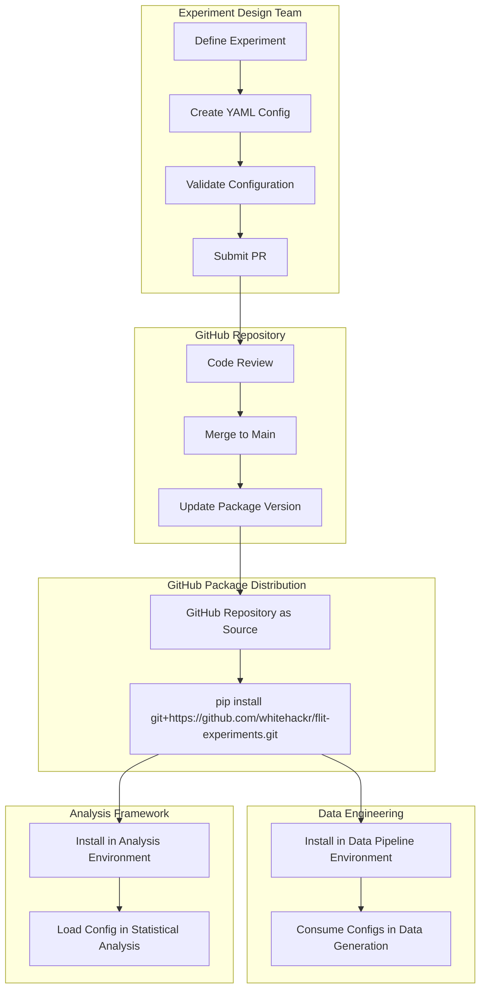

# Configuration Management for A/B Testing

**Version:** 1.0.0  
**Last Updated:** September 10, 2025  
**Authors:** Data Science & Data Engineering Teams  

Comprehensive guide to experiment configuration management, versioning workflows, and validation processes.

## Table of Contents

- [Overview](#overview)
- [Configuration Architecture](#configuration-architecture)
- [Configuration Schema](#configuration-schema)
- [Versioning Strategy](#versioning-strategy)
- [Validation Framework](#validation-framework)
- [Workflow Processes](#workflow-processes)
- [Integration Patterns](#integration-patterns)

## Overview

Configuration management is critical for reproducible, auditable A/B testing. Our approach treats experiment configurations as code, with version control, validation, and automated distribution to ensure analysts always use approved experimental parameters.

### Core Principles

1. **Configuration as Code**: All experiment specifications in version-controlled YAML
2. **GitHub-Based Distribution**: Configurations distributed via GitHub repository installation
3. **Validation First**: All configurations validated before deployment
4. **Experiment Versioning**: Individual experiments versioned within single package

## Configuration Architecture

### GitHub-Based Configuration System



### Repository Structure

```
flit-experiments/
├── flit_experiment_configs/              # Configuration Package
│   ├── __init__.py                       # Package initialization
│   ├── client.py                         # Configuration access API
│   ├── validation.py                     # Configuration validation
│   ├── configs/
│   │   └── experiments.yaml              # All experiment definitions
│   └── schemas/
│       └── experiment_schema.yaml        # Configuration schema definition
├── setup.py                              # Package build configuration
├── pyproject.toml                        # Modern Python packaging
└── README.md
```

## Configuration Schema

### Core Experiment Configuration

```yaml
# flit_experiment_configs/configs/experiments.yaml

free_shipping_threshold_test_v1_1_1:
  # Experiment Metadata
  design:
    experiment_name: "free_shipping_threshold_test_v1_1_1"
    version: "1.1.1"
    description: "Test impact of reducing free shipping threshold from $50 to $35"
    owner: "product-growth-team"
    stakeholders: ["product", "engineering", "finance"]
    created_date: "2024-02-15"
    
  # Hypothesis Definition
  hypothesis:
    primary: "Reducing free shipping threshold from $50 to $35 will increase conversion rate by 8% relative (4.5% → 4.86%) due to reduced purchase friction"
    secondary:
      - "Average order value may decrease by up to 5% due to lower threshold"
      - "Customer acquisition cost will remain stable"
    
  # Target Population
  population:
    eligibility_criteria:
      include:
        - new_customers
        - returning_customers
      exclude:
        - vip_customers
        - employee_accounts
        - test_accounts
    stratification:
      balance_across:
        - customer_segment
        - device_type
        - geo_region
    
  # Metrics Framework
  metrics:
    primary:
      name: "orders_per_eligible_user"
      description: "Count of orders placed during experiment period per eligible user"
      statistical_significance_level: 0.05
      business_significance_threshold: 0.20  # 20% minimum meaningful improvement
      direction: "increase"
      
    secondary:
      - name: "active_user_rate"
        description: "Percentage of users with at least one engagement event"
        guardrail_threshold: -0.02  # No more than 2% decrease acceptable
        direction: "stable"
        
      - name: "average_order_value"
        description: "Average revenue per order during experiment"
        guardrail_threshold: -0.15  # No more than 15% decrease acceptable
        direction: "decrease_acceptable"
        
      - name: "revenue_per_eligible_user"
        description: "Total revenue per eligible user during experiment"
        guardrail_threshold: -0.05  # No more than 5% decrease acceptable
        direction: "stable"
    
  # Statistical Design
  statistical_design:
    allocation_ratio: 0.5  # 50/50 split
    minimum_sample_size: 100
    target_power: 0.80
    effect_size: 0.08  # 8% relative improvement
    multiple_testing_correction: "bonferroni"
    
  # Operational Parameters
  operations:
    start_date: "2024-03-01"
    planned_duration_days: 14
    ramp_up_strategy: "immediate"  # vs "gradual"
    monitoring_frequency: "daily"
    
  # Risk Management
  guardrails:
    automatic_stop_conditions:
      - metric: "revenue_per_eligible_user"
        threshold: -0.10
        action: "immediate_stop"
      - metric: "error_rate"
        threshold: 0.05
        action: "immediate_stop"
    
    manual_review_triggers:
      - metric: "average_order_value"
        threshold: -0.10
        action: "stakeholder_review"

# Additional experiments with different versions...
checkout_simplification_test_v1_0_0:
  design:
    experiment_name: "checkout_simplification_test_v1_0_0"
    version: "1.0.0"
    # ... similar structure

free_shipping_threshold_test_v2_0_0:
  design:
    experiment_name: "free_shipping_threshold_test_v2_0_0"
    version: "2.0.0"
    # ... different approach with orders_per_user metric
```

### Configuration Schema Validation

```yaml
# flit_experiment_configs/schemas/experiment_schema.yaml

type: object
required: [design, hypothesis, population, metrics, statistical_design]

properties:
  design:
    type: object
    required: [experiment_name, version, description, owner]
    properties:
      experiment_name:
        type: string
        pattern: "^[a-z_]+_test(_v\\d+_\\d+_\\d+)?$"
      version:
        type: string
        pattern: "^\\d+\\.\\d+\\.\\d+$"
      description:
        type: string
        minLength: 20
        maxLength: 200
      owner:
        type: string
        enum: ["product-growth-team", "data-science-team", "engineering-team"]
      stakeholders:
        type: array
        items:
          type: string
          enum: ["product", "engineering", "finance", "marketing", "data-science"]
  
  metrics:
    type: object
    required: [primary]
    properties:
      primary:
        type: object
        required: [name, statistical_significance_level, business_significance_threshold]
        properties:
          name:
            type: string
            enum: ["orders_per_eligible_user", "conversion_rate", "revenue_per_user", "click_through_rate"]
          statistical_significance_level:
            type: number
            minimum: 0.01
            maximum: 0.10
          business_significance_threshold:
            type: number
            minimum: 0.01
            maximum: 1.0
      
      secondary:
        type: array
        items:
          type: object
          required: [name, guardrail_threshold]
          properties:
            name:
              type: string
            guardrail_threshold:
              type: number
              minimum: -1.0
              maximum: 1.0
  
  statistical_design:
    type: object
    required: [allocation_ratio, target_power, effect_size]
    properties:
      allocation_ratio:
        type: number
        minimum: 0.1
        maximum: 0.9
      target_power:
        type: number
        minimum: 0.70
        maximum: 0.95
      effect_size:
        type: number
        minimum: 0.01
        maximum: 1.0
```

## Versioning Strategy

### Semantic Versioning for Experiments

**Version Format**: `MAJOR.MINOR.PATCH`

- **MAJOR**: Breaking changes to experiment design (new hypothesis, different metrics)
- **MINOR**: Additive changes (new secondary metrics, extended timeline)
- **PATCH**: Bug fixes, clarifications, metadata updates

### Version Management Examples

```yaml
# Version 1.0.0: Initial experiment design
free_shipping_threshold_test_v1_0_0:
  metrics:
    primary:
      name: "conversion_rate"
    secondary: []

# Version 1.1.0: Added secondary metrics (MINOR)
free_shipping_threshold_test_v1_1_0:
  metrics:
    primary:
      name: "conversion_rate"  # Unchanged
    secondary:
      - name: "average_order_value"  # Added
      - name: "active_user_rate"     # Added

# Version 2.0.0: Changed primary metric (MAJOR)
free_shipping_threshold_test_v2_0_0:
  metrics:
    primary:
      name: "orders_per_eligible_user"  # Breaking change
    secondary:
      - name: "average_order_value"
```

### Package Versioning

```python
# setup.py
from setuptools import setup, find_packages

setup(
    name="flit_experiment_configs",
    version="1.2.0",  # Increment with each release
    packages=find_packages(),
    install_requires=[
        "pyyaml>=6.0",
        "pydantic>=1.10.0",
        "jsonschema>=4.0.0"
    ],
    python_requires=">=3.9",
)
```

## Validation Framework

### Configuration Validation Pipeline

```python
# flit_experiment_configs/validation.py

import yaml
import jsonschema
from typing import Dict, List, Any
from pydantic import BaseModel, ValidationError

class ExperimentValidator:
    """
    Comprehensive validation for experiment configurations
    
    Validates schema compliance, business logic, and cross-field consistency
    """
    
    def __init__(self, schema_path: str):
        with open(schema_path, 'r') as f:
            self.schema = yaml.safe_load(f)
    
    def validate_experiment(self, config: Dict[str, Any]) -> List[str]:
        """
        Validate single experiment configuration
        
        Returns list of validation errors (empty if valid)
        """
        errors = []
        
        # Schema validation
        try:
            jsonschema.validate(config, self.schema)
        except jsonschema.ValidationError as e:
            errors.append(f"Schema validation failed: {e.message}")
        
        # Business logic validation
        errors.extend(self._validate_business_logic(config))
        
        # Cross-field consistency validation
        errors.extend(self._validate_consistency(config))
        
        return errors
    
    def _validate_business_logic(self, config: Dict) -> List[str]:
        """Validate business-specific rules"""
        errors = []
        
        # Ensure statistical significance is achievable
        if 'statistical_design' in config:
            power = config['statistical_design'].get('target_power', 0.8)
            effect_size = config['statistical_design'].get('effect_size', 0.1)
            
            if power > 0.9 and effect_size < 0.05:
                errors.append(
                    "High power (>90%) with small effect size (<5%) may require "
                    "infeasibly large sample sizes"
                )
        
        # Validate guardrail thresholds are reasonable
        if 'metrics' in config and 'secondary' in config['metrics']:
            for metric in config['metrics']['secondary']:
                threshold = metric.get('guardrail_threshold', 0)
                if abs(threshold) > 0.5:  # >50% change
                    errors.append(
                        f"Guardrail threshold for {metric['name']} is very large: "
                        f"{threshold:.0%}. Consider if this is intentional."
                    )
        
        return errors
    
    def _validate_consistency(self, config: Dict) -> List[str]:
        """Validate cross-field consistency"""
        errors = []
        
        # Ensure experiment name matches version
        if 'design' in config:
            name = config['design'].get('experiment_name', '')
            version = config['design'].get('version', '')
            
            if version and f"_v{version.replace('.', '_')}" not in name:
                errors.append(
                    f"Experiment name '{name}' should include version '{version}'"
                )
        
        # Validate metric definitions match available data
        known_metrics = [
            'orders_per_eligible_user', 'conversion_rate', 'revenue_per_user',
            'average_order_value', 'active_user_rate'
        ]
        
        if 'metrics' in config:
            primary_metric = config['metrics'].get('primary', {}).get('name')
            if primary_metric and primary_metric not in known_metrics:
                errors.append(
                    f"Primary metric '{primary_metric}' not in known metrics: {known_metrics}"
                )
        
        return errors

# Pre-commit validation hook
def validate_all_experiments() -> bool:
    """
    Validate all experiments in the configuration file
    
    Used in CI/CD pipeline before package release
    """
    validator = ExperimentValidator('schemas/experiment_schema.yaml')
    
    with open('configs/experiments.yaml', 'r') as f:
        experiments = yaml.safe_load(f)
    
    all_valid = True
    for exp_name, exp_config in experiments.items():
        errors = validator.validate_experiment(exp_config)
        if errors:
            print(f"❌ Validation failed for {exp_name}:")
            for error in errors:
                print(f"  - {error}")
            all_valid = False
        else:
            print(f"✅ {exp_name} validation passed")
    
    return all_valid
```

### CI/CD Integration

```yaml
# .github/workflows/validate-configs.yml
name: Validate Experiment Configurations

on:
  pull_request:
    paths:
      - 'flit_experiment_configs/configs/**'
      - 'flit_experiment_configs/schemas/**'

jobs:
  validate:
    runs-on: ubuntu-latest
    steps:
      - uses: actions/checkout@v3
      
      - name: Set up Python
        uses: actions/setup-python@v4
        with:
          python-version: '3.11'
      
      - name: Install dependencies
        run: |
          pip install -r requirements.txt
          pip install -e .
      
      - name: Validate configurations
        run: |
          python -c "
          from flit_experiment_configs.validation import validate_all_experiments
          import sys
          if not validate_all_experiments():
              sys.exit(1)
          "
      
      - name: Version consistency check
        run: |
          python -c "
          import yaml
          with open('flit_experiment_configs/configs/experiments.yaml') as f:
              configs = yaml.safe_load(f)
          
          with open('setup.py') as f:
              setup_content = f.read()
          
          # Verify package version is newer than latest experiment version
          # Additional validation logic here
          "
```

## Workflow Processes

### Experiment Configuration Lifecycle

#### 1. Configuration Creation
```bash
# Create new experiment configuration
git checkout -b feature/new-experiment-config

# Edit configuration
vim flit_experiment_configs/configs/experiments.yaml

# Add new experiment following schema
```

#### 2. Local Validation
```bash
# Validate locally before committing
python -c "
from flit_experiment_configs.validation import validate_all_experiments
validate_all_experiments()
"

# Test configuration loading
python -c "
from flit_experiment_configs import get_experiment_config
config = get_experiment_config('your_new_experiment')
print('✅ Configuration loads successfully')
"
```

#### 3. Review Process
```bash
# Create pull request
git add flit_experiment_configs/configs/experiments.yaml
git commit -m "Add new experiment configuration: your_new_experiment"
git push origin feature/new-experiment-config

# GitHub PR triggers:
# - Automated validation
# - Schema compliance check
# - Stakeholder review (required approvals)
```

#### 4. Release Process
```bash
# After PR merge, create release
git tag v1.3.0  # Increment version
git push origin v1.3.0

# Users install via:
# pip install git+https://github.com/whitehackr/flit-experiments.git@v1.3.0
```

### Configuration Updates

#### For Running Experiments (Critical)
```bash
# NEVER modify running experiment configurations
# Create new version instead

# ❌ Wrong: Modify existing config
free_shipping_threshold_test_v1_1_0:
  metrics:
    primary:
      business_significance_threshold: 0.10  # Changed mid-experiment!

# ✅ Correct: Create new version
free_shipping_threshold_test_v1_1_1:
  metrics:
    primary:
      business_significance_threshold: 0.10  # New version
```

#### For Future Experiments (Safe)
```bash
# Safe to modify experiments not yet started
# But still follow review process for auditability
```

## Integration Patterns

### Analysis Framework Integration

```python
# analysis/business_intelligence.py
from flit_experiment_configs import get_experiment_config, ConfigurationError

def analyze_experiment(experiment_name: str) -> Dict:
    """
    Load experiment configuration and perform analysis
    
    Configuration drives all analysis parameters
    """
    try:
        # Load validated configuration
        config = get_experiment_config(experiment_name)
        
        # Extract analysis parameters from config
        primary_metric = config['metrics']['primary']['name']
        significance_level = config['metrics']['primary']['statistical_significance_level']
        business_threshold = config['metrics']['primary']['business_significance_threshold']
        
        # Perform analysis using config parameters
        results = statistical_engine.analyze_experiment(
            experiment_name=experiment_name,
            primary_metric=primary_metric,
            alpha=significance_level,
            minimum_effect_size=business_threshold
        )
        
        # Apply secondary metrics guardrails from config
        secondary_results = {}
        for secondary_metric in config['metrics'].get('secondary', []):
            metric_name = secondary_metric['name']
            guardrail_threshold = secondary_metric['guardrail_threshold']
            
            secondary_results[metric_name] = check_guardrail(
                metric_name, guardrail_threshold
            )
        
        return {
            'primary_analysis': results,
            'secondary_analysis': secondary_results,
            'config_version': config['design']['version']
        }
        
    except ConfigurationError as e:
        raise AnalysisError(f"Invalid experiment configuration: {e}")
```

### Data Pipeline Integration

```python
# data_platform/experiment_data_generator.py
from flit_experiment_configs import get_experiment_config

def generate_experiment_data(experiment_name: str, target_date: str):
    """
    Generate synthetic experiment data based on configuration
    
    Uses config to determine assignment ratios, eligibility criteria
    """
    config = get_experiment_config(experiment_name)
    
    # Use config for assignment logic
    allocation_ratio = config['statistical_design']['allocation_ratio']
    eligibility = config['population']['eligibility_criteria']
    
    # Generate data according to configuration
    return create_synthetic_experiment_data(
        experiment_name=experiment_name,
        target_date=target_date,
        treatment_ratio=allocation_ratio,
        eligibility_criteria=eligibility
    )
```

### Version Pinning Strategy

```python
# requirements.txt for production analysis
pip install git+https://github.com/whitehackr/flit-experiments.git@v1.2.0  # Pin specific version for reproducibility

# For development/testing
pip install git+https://github.com/whitehackr/flit-experiments.git  # Latest version
```

---

## Best Practices

### Configuration Design
1. **Start Simple**: Begin with minimal configuration, add complexity as needed
2. **Document Assumptions**: Include business context and assumptions in descriptions
3. **Version Conservatively**: Create new versions for any material changes
4. **Validate Early**: Run validation locally before committing

### Operational Guidelines
1. **Never Modify Running Experiments**: Always create new versions
2. **Review All Changes**: Require stakeholder approval for configuration changes
3. **Monitor Usage**: Track which configurations are actively used
4. **Archive Old Versions**: Remove configurations no longer needed

### Security Considerations
1. **No Sensitive Data**: Never include API keys or credentials in configurations
2. **Access Control**: Limit who can modify configuration repository
3. **Audit Trail**: Maintain complete history of configuration changes
4. **Review Process**: Require multiple approvals for high-impact experiments

---

**This configuration management framework ensures reproducible, auditable, and scalable A/B testing operations while maintaining statistical rigor and business alignment.**

---

**Documentation Version:** 1.0.0 | **Framework Version:** 1.0.0