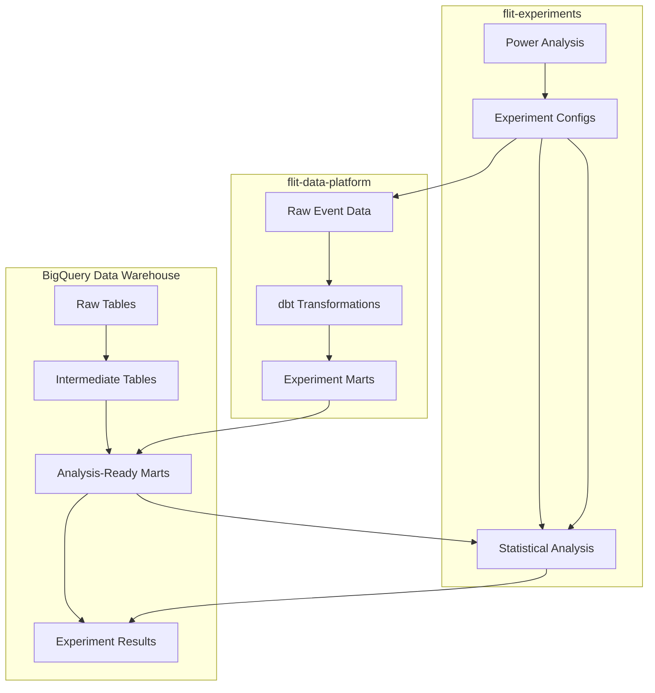

# Data Engineering Standards for A/B Testing

**Version:** 1.0.0  
**Last Updated:** September 10, 2025  
**Authors:** Data Science & Data Engineering Teams  

Enterprise-grade data engineering standards for A/B testing infrastructure, BigQuery schema design, and data quality assurance.

## 🚨 Implementation Status

**Current Reality**: This document describes the **ideal production architecture** for A/B testing data engineering. The actual implementation uses synthetic data and simulated assignments for demonstration purposes.

### Current Implementation
- **Data Source**: TheLook e-commerce dataset (synthetic)
- **Experiment Assignment**: Retroactively applied to historical data (not real-time)
- **Event Stream**: Simulated based on historical order data
- **Real-time Processing**: Not implemented (batch processing only)

### Production-Ready Components
- **Statistical Analysis Framework**: ✅ Ready for production
- **BigQuery Schema Design**: ✅ Production patterns documented
- **Data Quality Framework**: ✅ Validation patterns established
- **Configuration Management**: ✅ Package-based config system operational

This documentation serves as the **blueprint for production implementation** while the current system demonstrates the analytical capabilities using synthetic data.

---

## Table of Contents

- [Data Architecture](#data-architecture)
- [BigQuery Schema Design](#bigquery-schema-design)
- [Data Quality Framework](#data-quality-framework)
- [Performance Optimization](#performance-optimization)
- [Current Implementation Notes](#current-implementation-notes)

## Data Architecture

### Multi-Repository Data Flow (Production Target)



### Data Layer Definitions

#### 1. Raw Layer (`raw_*`)
**Purpose**: Immutable source of truth for all event data
**Schema**: Event-driven, append-only

```sql
-- Production target schema
CREATE TABLE `flit-data-platform.raw.user_events` (
    event_id STRING NOT NULL,
    user_id STRING NOT NULL,
    event_timestamp TIMESTAMP NOT NULL,
    event_type STRING NOT NULL,
    experiment_assignments ARRAY<STRUCT<
        experiment_name STRING,
        variant STRING,
        assignment_timestamp TIMESTAMP
    >>,
    event_properties JSON,
    _loaded_at TIMESTAMP DEFAULT CURRENT_TIMESTAMP()
);
```

#### 2. Analysis-Ready Marts
**Current Implementation**: Direct transformation from TheLook dataset

```sql
-- Current: mart_free_shipping_threshold_analysis (actual schema)
CREATE TABLE `flit-data-platform.marts.free_shipping_threshold_analysis` (
    user_id STRING NOT NULL,
    variant STRING NOT NULL,          -- Synthetically assigned
    assignment_date DATE NOT NULL,    -- Derived from order history
    orders_during_experiment INT64,   -- From thelook_ecommerce.orders
    revenue_during_experiment FLOAT64,
    is_active_user BOOL,
    _analysis_ready_at TIMESTAMP DEFAULT CURRENT_TIMESTAMP()
)
PARTITION BY assignment_date
CLUSTER BY variant;
```

## BigQuery Schema Design

### Normalized Experiment Results (Production-Ready)

#### Primary Metrics Table
```sql
CREATE TABLE `flit-data-platform.analysis_results.experiment_results_primary` (
    analysis_id STRING NOT NULL,
    experiment_name STRING NOT NULL,
    analysis_date DATE NOT NULL,
    
    -- Statistical Results
    control_mean FLOAT64 NOT NULL,
    treatment_mean FLOAT64 NOT NULL,
    relative_lift_percent FLOAT64 NOT NULL,
    p_value FLOAT64 NOT NULL,
    statistical_power FLOAT64 NOT NULL,
    
    -- Sample Information
    control_sample_size INT64 NOT NULL,
    treatment_sample_size INT64 NOT NULL,
    imbalance_factor FLOAT64 NOT NULL,
    
    -- Business Decision
    final_decision STRING NOT NULL,  -- LAUNCH, NO_LAUNCH, etc.
    
    _inserted_at TIMESTAMP DEFAULT CURRENT_TIMESTAMP()
)
PARTITION BY analysis_date
CLUSTER BY experiment_name, final_decision;
```

**✅ Current Status**: This schema is implemented and working with synthetic data

## Data Quality Framework

### Validation for Synthetic Data Environment

```python
def validate_synthetic_experiment_data(df: pd.DataFrame) -> List[str]:
    """
    Validate synthetic experiment data (current implementation)
    
    Adapted for TheLook dataset constraints
    """
    errors = []
    
    # Required fields for synthetic data
    required_fields = ['user_id', 'variant', 'orders_during_experiment']
    missing_fields = [f for f in required_fields if f not in df.columns]
    if missing_fields:
        errors.append(f"Missing required fields: {missing_fields}")
    
    # Synthetic assignment validation
    valid_variants = ['control', 'treatment']
    invalid_variants = ~df['variant'].isin(valid_variants)
    if invalid_variants.sum() > 0:
        errors.append(f"Invalid variants found: {df[invalid_variants]['variant'].unique()}")
    
    # Historical data constraints
    if 'assignment_date' in df.columns:
        future_assignments = df['assignment_date'] > pd.Timestamp.now().date()
        if future_assignments.sum() > 0:
            errors.append("Synthetic assignments cannot be in the future")
    
    return errors
```

### TheLook Dataset Integration

```python
def create_synthetic_experiment_assignment(
    orders_df: pd.DataFrame,
    experiment_config: Dict,
    assignment_method: str = "hash"
) -> pd.DataFrame:
    """
    Create synthetic experiment assignments from TheLook orders data
    
    Mimics real-time assignment for demonstration purposes
    """
    # Hash-based assignment for consistency
    if assignment_method == "hash":
        orders_df['assignment_hash'] = orders_df['user_id'].apply(
            lambda x: int(hashlib.md5(x.encode()).hexdigest(), 16)
        )
        orders_df['variant'] = orders_df['assignment_hash'].apply(
            lambda x: 'treatment' if x % 2 == 0 else 'control'
        )
    
    # Simulate assignment timestamp based on order history
    orders_df['assignment_date'] = orders_df.groupby('user_id')['created_at'].transform('min').dt.date
    
    return orders_df
```

## Performance Optimization

### Query Patterns for Synthetic Data

```sql
-- Optimized for TheLook dataset structure
WITH synthetic_experiment_data AS (
    SELECT 
        o.user_id,
        -- Synthetic variant assignment
        CASE 
            WHEN MOD(ABS(FARM_FINGERPRINT(o.user_id)), 2) = 0 THEN 'treatment'
            ELSE 'control'
        END as variant,
        COUNT(o.order_id) as orders_count,
        SUM(oi.sale_price) as total_revenue
    FROM `bigquery-public-data.thelook_ecommerce.orders` o
    JOIN `bigquery-public-data.thelook_ecommerce.order_items` oi
        ON o.order_id = oi.order_id
    WHERE o.created_at BETWEEN '2023-01-01' AND '2023-12-31'
    GROUP BY o.user_id
)

SELECT 
    variant,
    COUNT(*) as sample_size,
    AVG(orders_count) as mean_orders,
    STDDEV(orders_count) as std_orders
FROM synthetic_experiment_data
GROUP BY variant;
```

## Current Implementation Notes

### What Works Now
1. **Statistical Analysis**: Full framework operational with synthetic data
2. **Configuration Management**: Package-based configs working
3. **BigQuery Integration**: Normalized schema implemented and tested
4. **Power Analysis**: CLI working with historical traffic estimates

### Production Migration Path
1. **Replace TheLook with Real Events**: Implement event streaming
2. **Real-time Assignment**: Add assignment service for live experiments  
3. **Data Quality Monitoring**: Extend validation for production data volumes
4. **Security Implementation**: Add PII protection and access controls

### Synthetic Data Limitations
- **No Real User Behavior**: Assignment doesn't affect actual user actions
- **Historical Bias**: All "experiments" are retrospective
- **Limited Metrics**: Constrained by TheLook schema design
- **No Seasonality**: Missing real business calendar effects

---

**This document represents the production architecture target. The current implementation successfully demonstrates the statistical analysis capabilities using the documented patterns with synthetic data.**

---

**Documentation Version:** 1.0.0 | **Framework Version:** 1.0.0