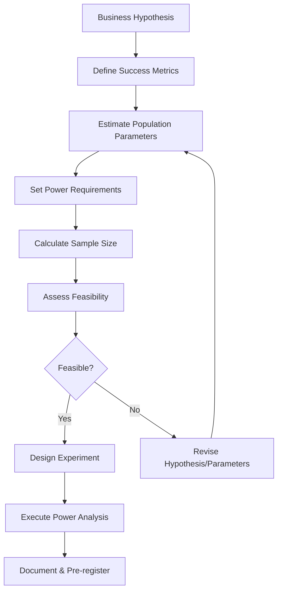

# Statistical Power Analysis Guide

**Version:** 1.0.0  
**Last Updated:** September 10, 2025  
**Authors:** Data Science Team  

Comprehensive methodology for statistical power analysis, sample size determination, and experiment feasibility assessment for A/B testing at scale.

## Table of Contents

- [Overview](#overview)
- [Theoretical Foundations](#theoretical-foundations)
- [Implementation Framework](#implementation-framework)
- [Power Analysis CLI](#power-analysis-cli)
- [Methodology](#methodology)
- [Business Applications](#business-applications)
- [Advanced Topics](#advanced-topics)
- [Troubleshooting](#troubleshooting)

## Overview

Statistical power analysis is the cornerstone of rigorous experimental design. It determines whether an experiment can reliably detect meaningful business effects before committing resources to data collection.

### Key Principles

1. **Effect Size First**: Business significance drives statistical design, not convenience
2. **Pre-Registration**: Power analysis must be completed before any data collection
3. **Resource Optimization**: Balance statistical rigor with operational constraints
4. **Risk Management**: Quantify probabilities of false positives and false negatives

### Core Questions Power Analysis Answers

- **Sample Size**: How many users do we need to detect our target effect?
- **Duration**: How long must the experiment run to collect required data?
- **Feasibility**: Can we realistically detect the effect size that matters to business?
- **Trade-offs**: What are the costs of Type I vs Type II errors for this decision?

## Theoretical Foundations

### Statistical Power Fundamentals

**Statistical Power (1 - β)**: The probability of correctly detecting a true effect when it exists.

**Key Relationships**:
```
Power = f(effect_size, sample_size, significance_level, population_variance)
```

**Standard Power Levels**:
- **80%**: Minimum acceptable for most business experiments
- **90%**: High confidence scenarios (irreversible decisions, high implementation costs)
- **95%**: Maximum practical level (diminishing returns beyond this point)

### Effect Size Frameworks

#### Cohen's Conventions (Interpretive Guidelines)
- **Small Effect (d = 0.2)**: Subtle but potentially valuable improvements
- **Medium Effect (d = 0.5)**: Clearly noticeable business impact
- **Large Effect (d = 0.8)**: Substantial business transformation

#### Business-Driven Effect Sizes
**Minimum Detectable Effect (MDE)**: The smallest improvement worth implementing

```python
def calculate_business_mde(
    implementation_cost: float,
    monthly_revenue_impact: float,
    payback_period_months: int = 6
) -> float:
    """
    Calculate minimum effect size worth detecting from business perspective
    
    Returns minimum relative improvement needed for positive ROI
    """
    required_monthly_lift = implementation_cost / payback_period_months
    mde_relative = required_monthly_lift / monthly_revenue_impact
    return mde_relative
```

### Sample Size Mathematics

#### For Proportions (Conversion Rates, CTR)
```python
def sample_size_proportions(
    p1: float,          # Control conversion rate
    p2: float,          # Treatment conversion rate  
    alpha: float = 0.05, # Significance level
    power: float = 0.80  # Statistical power
) -> int:
    """
    Calculate required sample size for proportion comparison
    
    Based on two-proportion z-test with continuity correction
    """
    from scipy import stats
    import math
    
    # Effect size calculation
    pooled_p = (p1 + p2) / 2
    effect_size = abs(p2 - p1) / math.sqrt(pooled_p * (1 - pooled_p))
    
    # Critical values
    z_alpha = stats.norm.ppf(1 - alpha/2)  # Two-tailed
    z_beta = stats.norm.ppf(power)
    
    # Sample size per group
    n_per_group = ((z_alpha + z_beta) / effect_size) ** 2
    
    return math.ceil(n_per_group)
```

#### For Continuous Metrics (Revenue, Time on Site)
```python
def sample_size_continuous(
    control_mean: float,
    treatment_mean: float,
    population_std: float,
    alpha: float = 0.05,
    power: float = 0.80
) -> int:
    """
    Calculate required sample size for continuous metric comparison
    
    Based on two-sample t-test (Welch's method for unequal variances)
    """
    from scipy import stats
    import math
    
    # Standardized effect size (Cohen's d)
    cohens_d = abs(treatment_mean - control_mean) / population_std
    
    # Critical values
    z_alpha = stats.norm.ppf(1 - alpha/2)
    z_beta = stats.norm.ppf(power)
    
    # Sample size per group (conservative estimate)
    n_per_group = 2 * ((z_alpha + z_beta) / cohens_d) ** 2
    
    return math.ceil(n_per_group)
```

## Implementation Framework

### Power Analysis Workflow



### Parameter Estimation Methods

#### Historical Data Analysis
```python
def estimate_baseline_parameters(
    historical_data: pd.DataFrame,
    metric_column: str,
    user_id_column: str = 'user_id',
    date_range_days: int = 30
) -> Dict[str, float]:
    """
    Estimate population parameters from historical data
    
    Returns baseline mean, std deviation, and sample variance
    """
    # Filter to relevant time period
    recent_data = historical_data.tail(date_range_days)
    
    # User-level aggregation (matching experiment design)
    user_metrics = recent_data.groupby(user_id_column)[metric_column].agg([
        'mean', 'std', 'count'
    ]).reset_index()
    
    # Population parameter estimates
    baseline_mean = user_metrics['mean'].mean()
    baseline_std = user_metrics['mean'].std()  # Between-user std
    sample_size = len(user_metrics)
    
    # Confidence intervals for estimates
    std_error = baseline_std / np.sqrt(sample_size)
    ci_lower = baseline_mean - 1.96 * std_error
    ci_upper = baseline_mean + 1.96 * std_error
    
    return {
        'baseline_mean': baseline_mean,
        'baseline_std': baseline_std,
        'estimate_ci_lower': ci_lower,
        'estimate_ci_upper': ci_upper,
        'sample_size': sample_size
    }
```

#### Pilot Study Approach
```python
def pilot_study_parameters(
    pilot_data: pd.DataFrame,
    scale_factor: float = 1.2
) -> Dict[str, float]:
    """
    Extract parameters from small-scale pilot study
    
    scale_factor: Conservative adjustment for full population variance
    """
    pilot_mean = pilot_data['metric'].mean()
    pilot_std = pilot_data['metric'].std() * scale_factor  # Conservative estimate
    
    return {
        'estimated_mean': pilot_mean,
        'estimated_std': pilot_std,
        'pilot_sample_size': len(pilot_data)
    }
```

## Power Analysis CLI

### CLI Interface

The `run_power_analysis.py` script provides comprehensive power analysis capabilities:

```bash
# Basic power analysis for experiment
python run_power_analysis.py free_shipping_threshold_test --reference-date 2024-03-01

# Detailed output with intermediate calculations
python run_power_analysis.py free_shipping_threshold_test --verbose

# Export results for documentation
python run_power_analysis.py free_shipping_threshold_test --output analysis.json

# List all available experiments
python run_power_analysis.py --list-experiments

# Sensitivity analysis across parameter ranges
python run_power_analysis.py free_shipping_threshold_test --sensitivity-analysis
```

### CLI Output Interpretation

**Standard Output Format**:
```
🧪 POWER ANALYSIS: free_shipping_threshold_test
📊 Reference Date: 2024-03-01
📈 Analysis Date: 2025-09-10

BASELINE PARAMETERS
├── Mean: 1.004 orders/user  
├── Std Dev: 1.234
├── Sample Size: 1,053 users
└── Historical Period: 30 days

EFFECT SIZE ANALYSIS  
├── Target Effect: +8% relative improvement
├── Absolute Difference: +0.080 orders/user
├── Cohen's d: 0.594 (Large effect)
└── Business Significance: ✅ Exceeds threshold

POWER CALCULATION
├── Required Sample (80% power): 92 total users
├── Required Sample (90% power): 123 total users  
├── Actual Sample Available: 1,053 users
├── Achieved Power: >99.9%
└── Status: ✅ FEASIBLE (Overpowered)

DURATION ESTIMATE
├── Daily Traffic: ~70 eligible users
├── Required Duration (80%): 1.3 days
├── Recommended Duration: 2-3 days
└── Business Calendar: Factor seasonal effects

RECOMMENDATIONS
⚠️  OVERPOWERED: Consider reducing sample size for efficiency
✅ FEASIBLE: Experiment can reliably detect target effect
🕒 SHORT DURATION: Quick results, minimal opportunity cost
```

### Configuration Integration

Power analysis automatically integrates with experiment configurations:

```yaml
# flit_experiment_configs/configs/experiments.yaml
free_shipping_threshold_test_v1_1_1:
  power_analysis:
    target_effect_size: 0.08  # 8% relative improvement
    minimum_power: 0.80
    significance_level: 0.05
    business_significance_threshold: 0.05  # 5% minimum meaningful effect
  
  historical_baseline:
    metric: orders_per_eligible_user
    reference_period_days: 30
    minimum_sample_size: 100
```

## Methodology

### Sequential Testing Integration

When planning experiments with early stopping capabilities:

```python
def sequential_power_analysis(
    baseline_mean: float,
    effect_size: float,
    max_looks: int = 4,
    alpha_spending: str = "obrien_fleming"
) -> Dict:
    """
    Calculate power requirements for sequential experiments
    
    Accounts for alpha spending across multiple interim analyses
    """
    # Alpha spending adjustments
    spending_functions = {
        'obrien_fleming': lambda k, K: alpha * math.sqrt(K/k),
        'pocock': lambda k, K: alpha / math.sqrt(2*K - 1),
        'lan_demets': lambda k, K: alpha * (k/K)**0.5
    }
    
    adjusted_alpha = spending_functions[alpha_spending](1, max_looks)
    
    # Recalculate sample size with adjusted alpha
    return sample_size_continuous(
        control_mean=baseline_mean,
        treatment_mean=baseline_mean * (1 + effect_size),
        alpha=adjusted_alpha,
        power=0.80
    )
```

### Multi-Metric Power Analysis

For experiments with multiple primary metrics:

```python
def bonferroni_correction_power(
    effect_sizes: List[float],
    num_metrics: int,
    alpha: float = 0.05
) -> Dict[str, int]:
    """
    Calculate sample sizes with Bonferroni correction for multiple testing
    
    Conservative approach: divide alpha by number of tests
    """
    adjusted_alpha = alpha / num_metrics
    
    sample_sizes = {}
    for i, effect_size in enumerate(effect_sizes):
        sample_sizes[f'metric_{i+1}'] = sample_size_continuous(
            control_mean=1.0,  # Normalized
            treatment_mean=1.0 + effect_size,
            alpha=adjusted_alpha,
            power=0.80
        )
    
    # Return the maximum required (most conservative)
    return {
        'individual_sample_sizes': sample_sizes,
        'required_sample_size': max(sample_sizes.values()),
        'adjustment_factor': num_metrics
    }
```

## Business Applications

### ROI-Based Power Analysis

```python
def roi_based_sample_sizing(
    monthly_revenue: float,
    experiment_cost_per_user: float,
    implementation_cost: float,
    min_roi_multiple: float = 3.0
) -> Dict:
    """
    Size experiments based on business ROI requirements
    
    Ensures experiment investment pays back through detected improvements
    """
    # Minimum effect size for positive ROI
    min_effect_for_roi = (
        implementation_cost / 
        (monthly_revenue * min_roi_multiple)
    )
    
    # Calculate sample size for this business-driven effect size
    required_sample = sample_size_continuous(
        control_mean=monthly_revenue,
        treatment_mean=monthly_revenue * (1 + min_effect_for_roi),
        power=0.80
    )
    
    total_experiment_cost = required_sample * experiment_cost_per_user
    
    return {
        'min_detectable_effect': min_effect_for_roi,
        'required_sample_size': required_sample,
        'total_experiment_cost': total_experiment_cost,
        'cost_per_user': experiment_cost_per_user,
        'roi_breakeven_effect': min_effect_for_roi
    }
```

### Resource Allocation Framework

```python
def optimize_experiment_portfolio(
    experiments: List[Dict],
    total_user_budget: int,
    time_horizon_days: int
) -> List[Dict]:
    """
    Optimize allocation of users across multiple experiments
    
    Prioritizes experiments by expected value per user allocated
    """
    def expected_value(exp):
        success_prob = exp['power']
        business_impact = exp['revenue_impact_monthly'] * 12  # Annual
        sample_required = exp['required_sample_size']
        
        return (success_prob * business_impact) / sample_required
    
    # Sort by expected value per user
    ranked_experiments = sorted(
        experiments, 
        key=expected_value, 
        reverse=True
    )
    
    # Allocate users greedily
    allocated_experiments = []
    remaining_users = total_user_budget
    
    for exp in ranked_experiments:
        if exp['required_sample_size'] <= remaining_users:
            allocated_experiments.append(exp)
            remaining_users -= exp['required_sample_size']
    
    return allocated_experiments
```

## Advanced Topics

### Non-Inferiority Testing

For experiments where "no worse than" is the success criterion:

```python
def non_inferiority_sample_size(
    control_rate: float,
    non_inferiority_margin: float,  # Maximum acceptable decrease
    alpha: float = 0.025,  # One-sided test
    power: float = 0.80
) -> int:
    """
    Calculate sample size for non-inferiority hypothesis
    
    H0: treatment_rate <= control_rate - margin
    H1: treatment_rate > control_rate - margin
    """
    from scipy import stats
    import math
    
    # Assume treatment rate equals control (null case)
    p_control = control_rate
    p_treatment = control_rate  # Conservative assumption
    
    # Pooled proportion under null hypothesis
    p_pooled = (p_control + (p_control - non_inferiority_margin)) / 2
    
    # Standard error
    se = math.sqrt(2 * p_pooled * (1 - p_pooled))
    
    # Critical values
    z_alpha = stats.norm.ppf(1 - alpha)  # One-sided
    z_beta = stats.norm.ppf(power)
    
    # Effect size relative to margin
    effect = non_inferiority_margin / se
    
    # Sample size calculation
    n_per_group = ((z_alpha + z_beta) / effect) ** 2
    
    return math.ceil(n_per_group)
```

### Bayesian Power Analysis

For experiments using Bayesian inference:

```python
def bayesian_sample_size(
    prior_mean: float,
    prior_precision: float,  # 1/variance
    desired_posterior_precision: float,
    credible_interval_width: float = 0.1
) -> int:
    """
    Calculate sample size for desired posterior precision in Bayesian framework
    
    Based on normal-normal conjugate model
    """
    # Posterior precision = prior precision + n * data precision
    # Solve for n given desired posterior precision
    
    data_precision = 1.0  # Assume standardized data
    required_n = (desired_posterior_precision - prior_precision) / data_precision
    
    return max(10, math.ceil(required_n))  # Minimum 10 observations
```

## Troubleshooting

### Common Issues and Solutions

#### Issue: "Infeasible Sample Size"
**Symptoms**: Required sample size exceeds available traffic
**Solutions**:
1. **Increase Effect Size**: Target larger, more meaningful changes
2. **Reduce Power**: Accept 75% power instead of 80% (document trade-offs)
3. **Extend Duration**: Run experiment longer to accumulate larger sample
4. **Sequential Testing**: Use early stopping to potentially reduce required duration

```python
def feasibility_alternatives(
    current_sample_requirement: int,
    available_daily_traffic: int,
    max_duration_days: int = 28
) -> Dict[str, Any]:
    """
    Generate alternative experimental designs when sample size is infeasible
    """
    max_achievable_sample = available_daily_traffic * max_duration_days
    
    alternatives = {}
    
    if current_sample_requirement > max_achievable_sample:
        # Option 1: Reduce power
        for power_level in [0.75, 0.70, 0.65]:
            alt_sample = int(current_sample_requirement * (power_level/0.80)**2)
            if alt_sample <= max_achievable_sample:
                alternatives[f'reduced_power_{int(power_level*100)}%'] = {
                    'sample_size': alt_sample,
                    'power': power_level,
                    'duration_days': alt_sample / available_daily_traffic
                }
                break
        
        # Option 2: Increase effect size target  
        for effect_multiplier in [1.25, 1.5, 2.0]:
            alt_sample = int(current_sample_requirement / (effect_multiplier**2))
            if alt_sample <= max_achievable_sample:
                alternatives[f'larger_effect_{effect_multiplier}x'] = {
                    'sample_size': alt_sample,
                    'effect_multiplier': effect_multiplier,
                    'duration_days': alt_sample / available_daily_traffic
                }
    
    return alternatives
```

#### Issue: "Overpowered Experiment"
**Symptoms**: Power > 95%, very short duration requirements
**Solutions**:
1. **Reduce Sample Size**: Use minimum viable sample for 80-85% power
2. **Increase Precision**: Test smaller, more nuanced effect sizes
3. **Add Secondary Metrics**: Use extra power to analyze trade-offs

#### Issue: "Unstable Historical Estimates"
**Symptoms**: Wide confidence intervals on baseline parameters
**Solutions**:
1. **Extend Historical Window**: Use longer time periods for parameter estimation
2. **Segment Analysis**: Separate analysis by user segments with different behaviors
3. **Conservative Estimates**: Use upper bounds of confidence intervals for variance

### Validation Checklist

Before finalizing power analysis:

- [ ] **Business Alignment**: Effect size represents meaningful business improvement
- [ ] **Historical Validation**: Baseline parameters estimated from representative data
- [ ] **Assumption Checks**: Normality, independence, stationarity verified
- [ ] **Sensitivity Analysis**: Results robust to parameter variations
- [ ] **Resource Feasibility**: Sample size achievable within timeline and budget
- [ ] **Statistical Assumptions**: Test assumptions match planned analysis methods
- [ ] **Documentation**: Analysis methodology and assumptions clearly documented

### Performance Optimization

For large-scale power analysis across many experiments:

```python
def batch_power_analysis(
    experiments: List[str],
    config_loader: ConfigLoader,
    parallel: bool = True
) -> Dict[str, Dict]:
    """
    Efficiently analyze power for multiple experiments
    
    Uses vectorized operations and parallel processing
    """
    if parallel:
        from multiprocessing import Pool
        with Pool(processes=4) as pool:
            results = pool.map(single_experiment_power_analysis, experiments)
    else:
        results = [single_experiment_power_analysis(exp) for exp in experiments]
    
    return dict(zip(experiments, results))
```

---

## References

1. Cohen, J. (1988). *Statistical Power Analysis for the Behavioral Sciences*
2. Lakens, D. (2013). Calculating and reporting effect sizes to facilitate cumulative science
3. Kohavi, R., Tang, D., Xu, Y. (2020). *Trustworthy Online Controlled Experiments*
4. Deng, A., Lu, J., Chen, S. (2016). Continuous monitoring of A/B tests without pain

---

**Documentation Version:** 1.0.0 | **Framework Version:** 1.0.0